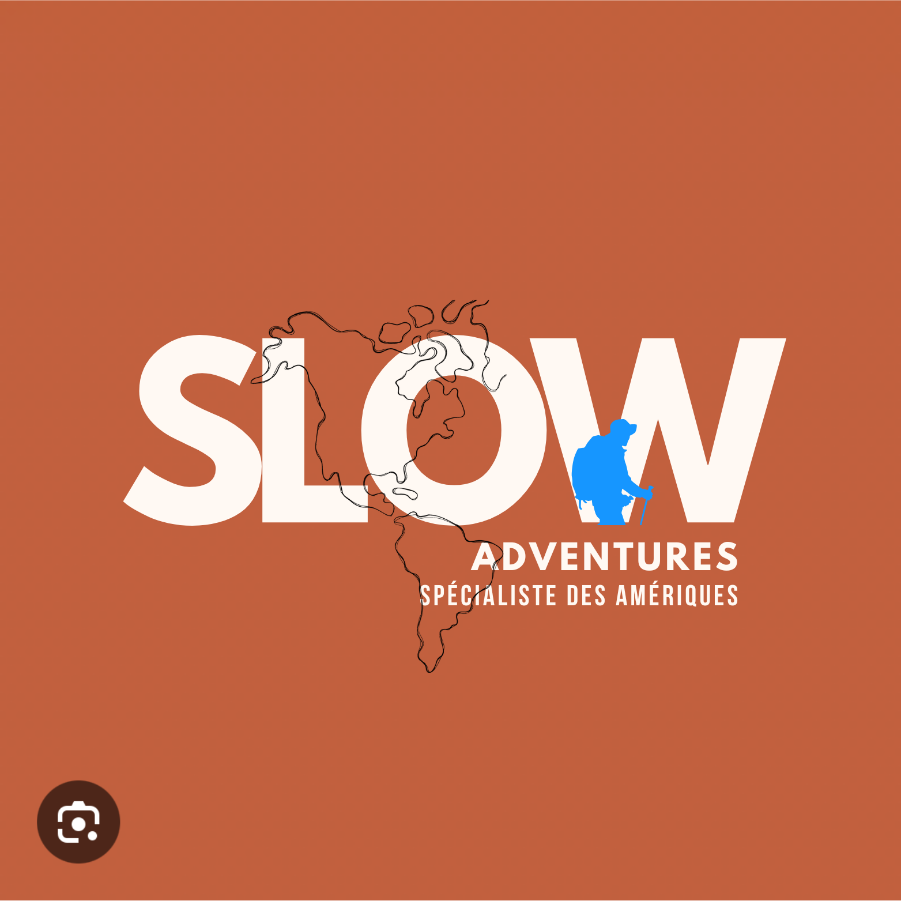

<p align="center">
  
</p>

<p align="center">
  <em>Porté par la passion — Des rêves habités, ni travel planner classique, ni agence.</em>
</p>

<p align="center">
  <a href="https://slowadventures.fr"><strong>https://slowadventures.fr</strong></a>
</p>

---

Service de création de voyages immersifs aux Amériques, fondé par Elena Dolla — spécialiste du slow travel. Le site web sert de vitrine de crédibilité dans le parcours **Instagram → Site → Contact**, transformant l'hésitation des visiteurs en confiance.

## L'équipe

- **Elena Dolla** — Travel Planner, créatrice de voyages immersifs & fondatrice
- **Pierre Gordé** — Développeur

### Elena

- Instagram Slow Adventures : [@slow*adventures*](https://instagram.com/slow_adventures_)
- Instagram Voyage : [@faistesvalises\_\_\_](https://instagram.com/faistesvalises___)
- Instagram Personnel : [@pearow](https://instagram.com/pearow)
- LinkedIn : [Elena Dolla](https://www.linkedin.com/in/elena-dolla-433884173/)
- WeRoad : [Profil Coordinatrice](https://www.weroad.fr/coordinateurs/elena-dolla-1)
- Malt : [Profil Freelance](https://www.malt.fr/profile/elenalorquindolla)

## Le concept

**Slow Adventures crée une catégorie nouvelle : les "rêves habités".**

- Spécialisation Amériques par passion vécue, pas par stratégie marketing
- Accompagnement humain et incarné — Elena = le produit
- Transparence totale sur le pricing (anti-agence classique)
- Double promesse sur chaque interaction : **rassurer ET faire rêver**

### Cibles principales

| Persona                          | Profil                                         | Doute principal                        |
| -------------------------------- | ---------------------------------------------- | -------------------------------------- |
| **Camille** (priorité lancement) | 34 ans, CSP+ self-made, voyageuse DIY fatiguée | "Elle va comprendre ce qu'on aime ?"   |
| **Antoine**                      | 29 ans, veut passer un cap vers les Amériques  | "Elle connaît vraiment ce pays ?"      |
| **Nathalie**                     | 41 ans, déclencheur de vie, premier solo       | "C'est safe ? Elle va comprendre ?"    |
| **Thomas** (B2B, post-MVP)       | CEO startup, séminaire corporate               | "Assez structurée pour 35 personnes ?" |

### Pricing

À partir de **300€** — Acompte 100€ au lancement, solde 200€ avant départ.
Early bird : **-100€** pour les premiers clients.

## Le site — MVP

Site **one-page, mobile-first** (80%+ du trafic depuis Instagram Stories). Chaque section joue un double rôle : rassurer ET faire rêver.

### Sections

1. **Hero** — Photo immersive plein écran + parallax + tagline + CTA
2. **Elena** — Storytelling anti-doute : qui elle est, pourquoi les Amériques
3. **Concept** — "Rêves habités" : positionnement et différenciation
4. **Destinations** — Aperçu visuel des Amériques, photos personnelles
5. **Pricing** — Transparent, process en 3 étapes
6. **Témoignages** — Social proof (bootstrappé si nécessaire)
7. **CTA récurrent** — "20 min, gratuit, sans engagement" → Calendly
8. **Capture email** — "Reçois nos inspirations voyage" → Brevo
9. **Footer** — Liens Instagram, mentions légales

### Critères de succès MVP

- Parcours Insta → Site → CTA → Calendly sans friction
- Au moins 1 discovery call réservée via le site en 2 mois
- Taux de rebond < 70%
- Go/No-Go : 3+ discovery calls en 3 mois → blog + SEO

## Stack technique

- **Astro** — SSG, performance native, SEO excellent, islands architecture
- **TypeScript** — Type safety et maintenabilité
- Mobile-first responsive design
- Core Web Vitals optimisés (LCP < 2.5s, FID < 100ms, CLS < 0.1)
- Images WebP, lazy loading, code splitting
- SEO : meta tags, Schema.org (LocalBusiness + TravelAgency), sitemap XML
- Google Analytics : tracking visites, rebond, clics CTA, sources UTM
- Micro-animations : fade-in au scroll, parallax Hero, hover CTA

## Design

### Palette

| Rôle                       | Couleur | Hex       |
| -------------------------- | ------- | --------- |
| Primary (terracotta chaud) | 🟠      | `#c0603e` |
| Secondary (bleu vif)       | 🔵      | `#1696ff` |
| Background (crème chaud)   | ⬜      | `#fff9f3` |

### Système de communication

- **Tagline** : "Porté par la passion"
- **CTA principal** : "Confiez-nous votre prochain rêve"
- **Sous-CTA** : "20 min, gratuit, sans engagement"

### Principes UX

- Le scroll est le storytelling — descente douce vers la confiance
- Transition seamless Instagram → Site (même univers visuel)
- Touch-first : scroll naturel, tap CTA, pas de hover complexe sur mobile
- Chargement instantané (< 2s) — un chargement lent tue le rêve
- Concis et impactant : chaque mot compte, zéro pavé

## Structure monorepo

| Dossier          | Description                          | README                         |
| ---------------- | ------------------------------------ | ------------------------------ |
| [`web/`](web/)   | Frontend Astro (SSG, Tailwind, GSAP) | [web/README.md](web/README.md) |
| [`api/`](api/)   | Backend (futur)                      | —                              |
| [`docs/`](docs/) | Documentation projet                 | —                              |

## Documentation projet

| Document                                                                              | Description                                     |
| ------------------------------------------------------------------------------------- | ----------------------------------------------- |
| [Brainstorming](/docs/brainstorming/brainstorming-session-2026-01-31.md)              | Session initiale — 54 idées, 4 phases d'analyse |
| [Product Brief](/docs/planning-artifacts/product-brief-slow-adventures-2026-02-03.md) | Vision produit, personas, métriques, scope MVP  |
| [UX Design Spec](/docs/planning-artifacts/ux-design-specification.md)                 | Spécification UX complète, parcours, composants |
| [UX Directions](/docs/planning-artifacts/ux-design-directions.html)                   | Explorations visuelles et directions de design  |

## Cycle de dev par story

```
/bmad-bmm-create-story  →  prepare la story
/bmad-bmm-dev-story     →  implemente la story
/bmad-bmm-code-review   →  review adversariale
Repeter pour la story suivante
```

## Assets

Le dossier `assets/` à la racine du repo contient les images sources non optimisées et non utilisées (logos, photos par section). Elles sont disponibles pour être ajoutées dans `web/` si besoin, après optimisation.

## Installation

```bash
npm install
npm run dev
```

## Scripts

```bash
npm run dev      # Développement
npm run build    # Production build
npm run test     # Tests
npm run lint     # Linting
```

## Licence

Propriétaire — Slow Adventures © 2026
