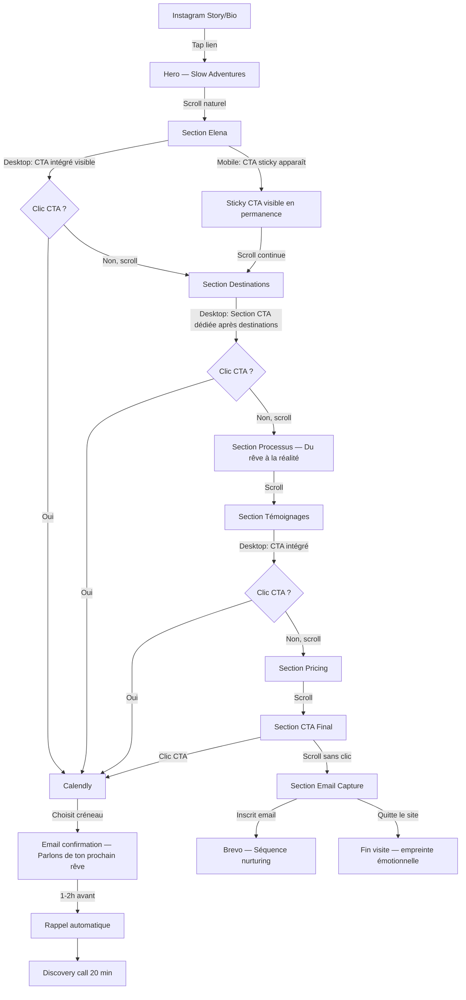
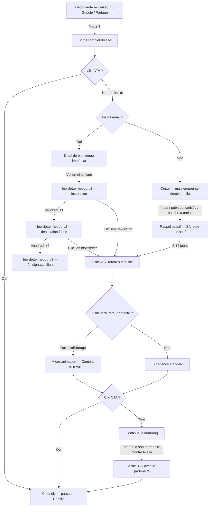
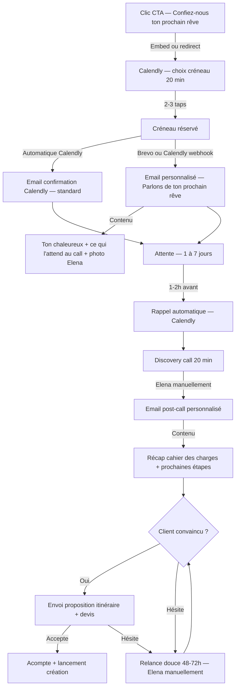
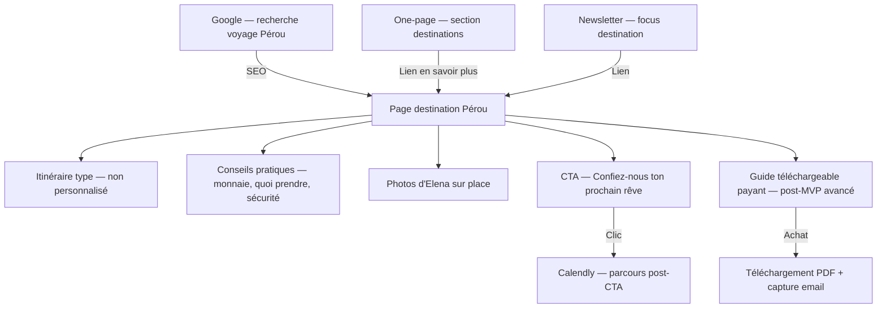

# UX Design Specification slow-adventures

**Author:** Elena
**Date:** 2026-02-06

---

<!-- UX design content will be appended sequentially through collaborative workflow steps -->

## Executive Summary

### Project Vision

Site web one-page mobile-first pour Slow Adventures, service de création de voyages immersifs aux Amériques par Elena. Le site fonctionne comme un **argumentaire anti-doute** dans le parcours Instagram → Site → Contact, avec une double mission : rassurer et faire rêver. Positionnement : catégorie nouvelle "rêves habités" — ni travel planner classique, ni agence.

**Stack envisagée :** Astro (SSG, performance native, SEO excellent, islands architecture pour composants interactifs)

**Palette :** Primary #c0603e (terracotta chaud), Secondary #1696ff (bleu vif), Background #fff9f3 (crème chaud)

**Système de communication :** Tagline "Porté par la passion" / CTA "Confiez-nous votre prochain rêve" / Sous-CTA "20 min, gratuit, sans engagement"

### Target Users

- **Camille (priorité lancement)** : CSP+ self-made, 34 ans, voyageuse expérimentée DIY fatiguée. 80% du trafic = mobile depuis Instagram. Doute : "elle va comprendre ce qu'on aime ?"
- **Antoine** : 29 ans, veut passer un cap vers les Amériques. Doute : "elle connaît vraiment ce pays ?"
- **Nathalie** : 41 ans, déclencheur de vie, premier voyage solo. Cycle de décision long (2 semaines). Doute : "c'est safe ? elle va comprendre ?"
- **Thomas (B2B, post-MVP)** : CEO startup, séminaire corporate

### Key Design Challenges

1. **Trou noir pré-contact** : maximiser la conversion au premier passage tout en respectant le temps de réflexion (Nathalie = 2 semaines). Capture email comme filet de sécurité
2. **Double émotion par section** : chaque bloc doit rassurer ET faire rêver simultanément sans surcharger visuellement
3. **Crédibilité freelance débutante** : peu de témoignages, pas de portfolio massif — le design doit compenser par professionnalisme et émotion
4. **Transition seamless Insta → Site** : 80%+ du trafic mobile depuis Stories, pas de choc visuel entre l'univers Instagram d'Elena et le site

### Design Opportunities

1. **Storytelling par le scroll** : le one-page raconte une histoire linéaire d'Elena au CTA — le scroll EST le storytelling
2. **Micro-animations comme signature** : fade-in, parallax, transitions créent le vibe "dreamy, warm" — avantage concurrentiel vs sites TP statiques
3. **CTA basse friction** : "20 min, gratuit, sans engagement" = pattern UX puissant, design chaleureux pas agressif
4. **Photos personnelles = authenticité** : connexion humaine impossible à reproduire par les concurrents

---

## Core User Experience

### Defining Experience

**Action primaire :** Le clic sur "Confiez-nous votre prochain rêve" → Calendly. Tout le one-page converge vers ce moment. L'email capture est le filet de sécurité secondaire.

**Le scroll comme véhicule :** L'utilisateur ne "décide" pas de continuer à scroller — il est emporté par l'histoire. Chaque section nourrit l'émotion de la précédente. Le site est une descente douce vers la confiance.

**Le moment de différenciation :** Section Elena. Quand Camille voit une vraie personne passionnée au lieu d'un logo corporate, elle sait que c'est différent.

### Platform Strategy

- **Mobile-first absolu** : 80%+ du trafic depuis Instagram Stories
- **Web uniquement** : site Astro SSG, pas d'app native
- **Pas de fonctionnalité offline** nécessaire
- **Touch-first** : scroll vertical naturel, tap sur CTA, pas de hover complexe sur mobile
- **Transition Insta → Site seamless** : même univers visuel, pas de rupture émotionnelle

### Effortless Interactions

| Interaction       | Doit être...                                                        |
| ----------------- | ------------------------------------------------------------------- |
| **Scroll**        | Fluide, immersif, naturel — l'utilisateur est "porté"               |
| **CTA principal** | Visible sans chercher, chaleureux pas agressif, toujours accessible |
| **Chargement**    | Instantané (< 2s) — un chargement lent tue le rêve                  |
| **Lecture**       | Concise et impactante — pas de pavés, chaque mot compte             |
| **Prise de RDV**  | Clic → Calendly → créneau en 3 taps max                             |
| **Capture email** | Un champ, un bouton, zéro friction                                  |

### Critical Success Moments

**Ce qui ruinerait tout :**

- Chargement trop lent sur mobile (le rêve s'évapore)
- CTA invisible ou trop compliqué à trouver
- Texte trop long qui fait décrocher
- Visuels qui ne font pas rêver (photos stock = mort immédiate)
- Expérience trop longue et pas assez stimulante sensoriellement
- Ton trop corporate OU trop casual — pas le bon équilibre

**Ce qui crée le succès :**

- Le moment où Camille voit Elena (section About) et se dit "elle est vraie"
- Le moment où les destinations défilent et les sens sont stimulés
- Le moment où le pricing est clair et transparent ("pas de piège")
- Le moment où le CTA dit "20 min, gratuit, sans engagement" et la barrière tombe

### Experience Principles

1. **"Emporter, pas convaincre"** — Le site ne vend pas, il emporte. Le scroll est une expérience sensorielle qui stimule le rêve du début à la fin
2. **"Chaleureux mais pro"** — Tutoiement, ton friendly, énergie solaire — mais jamais amateur. Juste milieu entre la copine qui voyage et l'experte qui gère
3. **"Rien ne freine le rêve"** — Chargement instantané, textes courts et impactants, visuels qui font voyager, zéro friction
4. **"Le CTA est une invitation, pas une vente"** — Main tendue, design chaleureux et accueillant, couleur terracotta, arrondi, pas d'agressivité
5. **"Les sens d'abord"** — Photos personnelles, couleurs chaudes, micro-animations, transitions fluides. L'émotion passe par les sens avant la raison. Stimuler sans surcharger

---

## Desired Emotional Response

### Primary Emotional Goals

**Émotion dominante : La nostalgie d'un rêve pas encore vécu**

L'utilisateur qui quitte le site sans cliquer le CTA doit emporter avec lui une empreinte émotionnelle — pas une information, mais un sentiment. Un mélange de :

- **Envie** — "j'ai envie de vivre ça"
- **Curiosité** — "c'est pas comme d'habitude, c'est un système différent"
- **Nostalgie anticipée** — le rêve s'est installé, il ne s'efface plus

La confiance commence à se construire mais n'est pas l'émotion dominante au premier contact (pas encore d'échange humain). Elle se renforce visuellement par la qualité du site et la spécialisation visible.

**Émotion de recommandation :** "Elle est géniale, elle s'y connaît à fond, elle bosse avec des partenaires sur place — c'est hyperfluide, tu te prends pas la tête."

### Emotional Journey Mapping

| Phase du parcours           | Émotion cible            | Signal UX                                                                                                     |
| --------------------------- | ------------------------ | ------------------------------------------------------------------------------------------------------------- |
| **Arrivée (0-3s)**          | "Je suis au bon endroit" | Chaleur visuelle + spécialisation Amériques immédiate + énergie humaine (pas corporate)                       |
| **Scroll Hero → About**     | Envie + curiosité        | Visuels immersifs, mouvement subtil, ambiance sensorielle                                                     |
| **Section Elena**           | Confiance + connexion    | Vraie personne passionnée, ton friendly et pro. "Elle sait de quoi elle parle, et en plus elle a l'air sympa" |
| **Destinations / Offre**    | Rêve + projection        | L'utilisateur se voit là-bas. Stimulation sensorielle des Amériques                                           |
| **Section Pricing**         | Soulagement + clarté     | Transparent, pas de piège, abordable. La barrière financière tombe                                            |
| **CTA**                     | Invitation chaleureuse   | Main tendue, pas pression. "20 min, gratuit, sans engagement"                                                 |
| **Post-visite (sans clic)** | Nostalgie + trace        | Le rêve reste. L'email capture prolonge le lien                                                               |

### Micro-Emotions

**Tensions émotionnelles à gérer :**

| Tension                   | Résolution design                                                                                                                                            |
| ------------------------- | ------------------------------------------------------------------------------------------------------------------------------------------------------------ |
| **Rêve vs Peur**          | Le rêve d'abord, la réassurance suit rapidement. La qualité du site elle-même rassure (pro = safe). Les deux peuvent coexister en parallèle mais subtilement |
| **Curiosité vs Méfiance** | La spécialisation Amériques crédibilise. Le côté humain désarme. Le site interactif et soigné prouve que ce n'est pas une amatrice                           |
| **Envie vs Inertie**      | Le CTA basse friction ("20 min, gratuit") réduit le coût psychologique de l'action. L'email capture rattrape ceux qui ne sont pas prêts                      |
| **Confiance vs Distance** | La confiance totale vient après l'échange humain (discovery call). Le site doit amener assez de confiance pour déclencher ce premier pas                     |

**Micro-émotions critiques par persona :**

- **Camille** : "Elle va comprendre ce qu'on aime" → réponse : ton personnalisé, pas de formules, "tout est possible"
- **Antoine** : "Elle connaît vraiment ?" → réponse : spécialisation visible, partenaires locaux, expertise terrain
- **Nathalie** : "C'est safe ?" → réponse : professionnalisme du site, transparence, ton rassurant

### Design Implications

| Objectif émotionnel              | Implication UX                                                                                                                                              |
| -------------------------------- | ----------------------------------------------------------------------------------------------------------------------------------------------------------- |
| **Nostalgie d'un rêve**          | Photos personnelles immersives, couleurs chaudes, transitions lentes et fluides, espace blanc généreux                                                      |
| **"Pas une commerciale"**        | Zéro langage de vente. Le CTA est une invitation, jamais une injonction. Pas de compteur d'urgence, pas de "offre limitée"                                  |
| **Spécialisation = crédibilité** | Les Amériques visibles dès le Hero. Noms de pays/régions, visuels spécifiques (pas des photos génériques "voyage")                                          |
| **Humain > Corporate**           | Photo d'Elena visible tôt. Tutoiement. Ton conversationnel. Pas de stock photos de personnes                                                                |
| **Pro mais pas froid**           | Qualité technique du site (animations, transitions, performance) = signal de professionnalisme. Le design fait le travail que les mots ne doivent pas faire |
| **Fluide, pas de prise de tête** | Scroll sans friction, textes courts, parcours linéaire évident, CTA accessible sans chercher                                                                |

### Emotional Design Principles

1. **"Laisser une trace, pas juste informer"** — Chaque visite doit déposer un rêve. Même sans conversion, l'empreinte émotionnelle persiste et travaille. Le site crée de la nostalgie anticipée
2. **"Passionnée, pas commerciale"** — Elena vend du rêve parce que c'est sa passion, pas son business. Le site reflète cette authenticité — zéro technique de vente, zéro pression, zéro urgence artificielle
3. **"Le rêve d'abord, la confiance suit"** — L'émotion ouvre la porte, la qualité rassure. Le professionnalisme se prouve par le design, pas par les mots. La réassurance est là mais subtile, jamais en premier plan
4. **"Spécialiste, pas généraliste"** — L'émotion de crédibilité vient de la niche assumée. Chaque élément rappelle : Amériques, slow, immersif. Cette spécialisation rassure plus que n'importe quel témoignage
5. **"La recommandation se vit, elle ne s'argumente pas"** — L'émotion qu'on veut transmettre par le bouche-à-oreille : fluidité ("zéro prise de tête"), expertise ("elle connaît à fond"), humanité ("elle est géniale")

---

## UX Pattern Analysis & Inspiration

### Inspiring Products Analysis

**Copines de Voyage — L'emportement visuel**

- Hero vidéo drone : l'utilisateur est immédiatement transporté sans effort. La destination importe peu — c'est le mouvement et l'émotion qui accrochent
- Humain visible partout : fondatrices nommées avec vraies photos, social proof tissé dans le flux
- CTAs en première personne ("Je m'inscris") — l'utilisateur est sujet de l'action
- **Pattern à adopter** : le hero immersif vidéo/animation comme première impression émotionnelle. La preuve sociale intégrée au flux, pas isolée

**Apple (pages produit) — Le scroll comme narration**

- Scroll-controlled canvas : séquence d'images contrôlée par le pouce, "vidéo dont tu es le maître"
- Structure en 3 actes : Désir → Capacité → Valeurs + Action
- Bénéfices humains plutôt que specs ("Keep on zoomin'" plutôt que "50MP")
- Sections expandables : overview émotionnel visible, détails logistiques en accordion
- **Pattern à adopter** : scroll-triggered animations (GSAP ScrollTrigger), textes courts orientés bénéfice, sections expandables pour le détail

**Black Tomato — Le feeling-first**

- Navigation par l'émotion ("Comment voulez-vous vous sentir ?") au lieu de la destination
- Positionnement contrarian : le silence au milieu du bruit. Pas de prix visibles = bespoke
- Badges presse et confiance placés à côté des CTAs au moment de la décision
- **Pattern à adopter** : sections organisées par émotion/style de voyage, trust signals adjacents au CTA

**Airbnb — La chaleur du design system**

- Category chips émotionnels : navigation par le feeling, pas par la logique
- Typographie warm-but-pro (famille Circular/Cereal)
- Photos comme contenu principal, texte comme annotation secondaire
- Micro-animations au tap/hover : scale-up subtil, transitions fluides
- **Pattern à adopter** : typo distinctive warm+pro, photo-first, micro-animations comme signature

**Lusion.co — L'immersion totale**

- "Scroll to explore" comme invitation explicite dans le hero
- Header minimal/invisible pendant les sections immersives
- Contenu révélé progressivement : chaque scroll = une récompense
- **Pattern à adopter** : invitation au scroll, header qui s'efface pendant l'immersion, reveal progressif

### Transferable UX Patterns

**Patterns de navigation :**

- Header minimal/transparent qui s'efface pendant le hero immersif, réapparaît ensuite
- CTA sticky en bas de mobile (zone du pouce) après la première section
- Scroll linéaire one-page sans navigation complexe

**Patterns d'interaction :**

- Scroll-triggered image sequence dans le hero (30-60 frames drone, contrôle au pouce via GSAP ScrollTrigger + Canvas)
- Fade-in progressif des sections au scroll (IntersectionObserver)
- Sections expandables/accordion pour le détail (itinéraire, pricing) derrière l'overview émotionnel
- "Scroll to explore" comme invitation dans le hero

**Patterns visuels :**

- Typo distinctive : serif éditorial pour les titres (Cormorant Garamond, Playfair Display) + sans-serif warm pour le body (DM Sans, Plus Jakarta Sans)
- Photo-first : les photos d'Elena sont le contenu principal, le texte annote
- Espacement généreux : line-height 1.6-1.8, padding de section large, respiration visuelle
- Transition dark → warm : hero sombre/cinématique (rêve) → sections claires/chaleureuses (réassurance)

**Patterns de conversion :**

- CTA Hero (soft) : "Confiez-nous votre prochain rêve"
- CTA sticky mobile (après 1ère section) : "Réservez votre appel découverte"
- CTA mid-page (après social proof) : personnalisé avec le nom d'Elena
- CTA final (bottom) : "Prête à rêver ?" — fermeture émotionnelle
- Trust signals adjacents à chaque CTA (pas dans une section séparée)

### Anti-Patterns to Avoid

| Anti-pattern                         | Pourquoi c'est toxique                                              | Notre alternative                                                                                 |
| ------------------------------------ | ------------------------------------------------------------------- | ------------------------------------------------------------------------------------------------- |
| **Grille de destinations avec prix** | Transforme les rêves en catalogue. Aucune différenciation           | Histoires de voyage, pas des fiches produit. "Le matin où on a vu les condors au Canyon de Colca" |
| **Barre de recherche en Hero**       | Signal "self-service" quand la valeur c'est "on fait tout pour toi" | CTA unique et chaleureux. Le hero existe pour créer du désir, pas collecter des données           |
| **Stock photos**                     | Les mêmes images sur 500 sites = zéro authenticité                  | Exclusivement les photos personnelles d'Elena, même si techniquement imparfaites                  |
| **Palette bleu-vert-orange**         | Code couleur générique "industrie voyage"                           | Palette terracotta/crème/warm unique, ancrage terre des Amériques                                 |
| **Fondateur invisible**              | "Notre équipe d'experts" = zéro confiance pour du sur-mesure        | Elena visible dès le premier scroll, pas dans un "À propos"                                       |
| **Chatbot surgissant**               | Prend de la place, casse l'immersion, agace                         | Zéro chatbot. Le CTA Calendly suffit                                                              |
| **Carrousels automatiques**          | Daté, frustrant si trop rapide, enlève le contrôle à l'utilisateur  | Scroll contrôlé par l'utilisateur ou grille fixe                                                  |
| **Formulaires à rallonge**           | Abandon immédiat                                                    | Un champ email max pour la capture. Le reste se fait en discovery call                            |
| **Itinéraire-tableau**               | "Jour 1: Arrivée" = logistique, pas rêve                            | Arc émotionnel : "Jour 1 : Le vertige de l'arrivée" + accordion pour les détails                  |
| **Référence/recherche cassée**       | L'utilisateur arrive avec une intention et se retrouve bloqué       | Parcours linéaire clair, pas de recherche nécessaire sur un one-page                              |

### Design Inspiration Strategy

**À adopter directement :**

- Hero immersif avec vidéo/animation scroll-triggered (inspiration Copines de Voyage + Apple)
- Photos personnelles d'Elena comme contenu principal (anti stock photos)
- CTA basse friction sticky en mobile (zone pouce)
- Trust signals adjacents aux CTAs (inspiration Black Tomato)
- Reveal progressif au scroll avec micro-animations (GSAP ScrollTrigger)
- Typo distinctive warm : serif éditorial + sans-serif chaleureux

**À adapter au contexte Slow Adventures :**

- Le scroll-controlled canvas Apple (séquence drone) → version allégée 30 frames max pour le mobile (performance)
- Le feelings-first de Black Tomato → sections par style de voyage émotionnel, pas par destination
- Les category chips Airbnb → pas de navigation complexe, mais des ancres émotionnelles dans le scroll
- L'expandable content Apple → accordion pour pricing et détails pratiques derrière l'overview émotionnel

**À éviter absolument :**

- Toute la palette UX "agence de voyage standard" (barre de recherche, grille destinations, palette bleue)
- Chatbots, pop-ups, carrousels automatiques
- Formulaires de plus d'un champ
- Stock photos de quelque nature que ce soit
- Header lourd qui concurrence le contenu immersif

---

## Design System Foundation

### Design System Choice

**Tailwind CSS** avec design tokens personnalisés, intégré nativement dans Astro.

Approche utility-first sans composants pré-faits — chaque élément du site est conçu sur-mesure pour l'identité Slow Adventures. Aucun "look framework" reconnaissable.

### Rationale for Selection

| Critère              | Pourquoi Tailwind                                                                                 |
| -------------------- | ------------------------------------------------------------------------------------------------- |
| **Unicité visuelle** | Utility-first = pas de composants pré-stylés. Le site ne ressemblera à aucun template             |
| **Performance**      | Purge automatique du CSS non utilisé. Bundle CSS minimal → Core Web Vitals optimisés              |
| **Astro natif**      | Intégration officielle Astro + Tailwind, zero config                                              |
| **Développeur solo** | Pierre développe seul — Tailwind est plus rapide à écrire et itérer qu'un CSS custom from scratch |
| **GSAP compatible**  | Les animations scroll-triggered (ScrollTrigger) fonctionnent indépendamment du système CSS        |
| **Scalable**         | Les design tokens définis maintenant servent pour le blog et les pages futures post-MVP           |

### Implementation Approach

**Stack animation :**

- **GSAP + ScrollTrigger** : animations scroll-triggered sur tout le site, chargé intelligemment via `client:visible` sur les composants Astro (lazy-load, pas au premier octet)
- **Tailwind transitions** : micro-interactions simples (hover, focus, tap feedback)
- **CSS natif** : keyframes pour les animations persistantes (loading, pulse CTA)

**Stack typographique (Google Fonts, disponibles Canva) :**

- Titres : **Lora** (semi-bold 600) — chaleureuse, élégante, lisible mobile
- Body : **Plus Jakarta Sans** (regular 400 / medium 500 / semi-bold 600) — warm, moderne, friendly
- Hébergement : Google Fonts avec `font-display: swap` pour la performance
- Cohérence cross-canal : mêmes typos utilisables sur Canva pour les posts Instagram

**Stack images :**

- Format WebP avec fallback JPEG
- Lazy loading natif (`loading="lazy"`)
- `<picture>` avec art direction responsive (portrait mobile / paysage desktop)
- Compression via Astro Image (sharp)

**Architecture composants Astro :**

```
src/
  components/
    Hero.astro              (client:load — GSAP hero séquence)
    StickyMobileCTA.astro    (client:load — visible dès le scroll)
    SectionReveal.astro      (client:visible — fade-in GSAP)
    CTAButton.astro          (statique — zero JS)
    TestimonialCard.astro    (statique — zero JS)
    EmailCapture.astro       (client:visible — Brevo integration)
    AccordionDetail.astro    (client:visible — expand/collapse)
    DestinationCard.astro    (statique — zero JS)
  layouts/
    BaseLayout.astro
  styles/
    tokens.css
```

5 composants statiques (zero JS) + 4 islands interactifs. Breakpoints principaux : `sm` (640px) et `lg` (1024px).

### Customization Strategy

**Palette complète :**

| Token              | Hex     | Usage                                 |
| ------------------ | ------- | ------------------------------------- |
| `terracotta`       | #c0603e | Primary — CTA, accents, énergie       |
| `terracotta-light` | #d4856a | Hover states                          |
| `terracotta-dark`  | #a04e30 | Active states                         |
| `terracotta-muted` | #c9a08e | Disabled / muted                      |
| `bleu`             | #1696ff | Secondary — liens, accents froids     |
| `creme`            | #fff9f3 | Background principal                  |
| `creme-dark`       | #f5ede3 | Sections alternées (contraste subtil) |
| `sauge`            | #7B8F6B | Réassurance, succès, check marks      |
| `ambre`            | #D4956A | Accents luxe, séparateurs, détails    |
| `warm-black`       | #2c2825 | Texte principal (jamais noir pur)     |
| `warm-gray`        | #6b5e52 | Texte secondaire                      |
| `white`            | #ffffff | Cards, overlays                       |

**Shadows chaudes (teintées terracotta) :**

- Cards : `0 4px 24px rgba(192, 96, 62, 0.08)`
- CTA hover : `0 8px 32px rgba(192, 96, 62, 0.15)`

**Design tokens Tailwind :**

```
fontFamily:
  serif:    ['Lora', 'Georgia', serif]
  sans:     ['Plus Jakarta Sans', 'system-ui', sans-serif]

borderRadius:
  soft:     '8px'     (boutons, cards)
  round:    '24px'    (chips, tags)
  full:     '9999px'  (avatars, badges)

spacing:
  section:  '80px' (mobile) / '120px' (desktop)
  content:  '24px' (mobile) / '48px' (desktop)

fontSize:
  hero:     'clamp(2.5rem, 5vw, 4.5rem)'
  h2:       'clamp(1.75rem, 3vw, 2.5rem)'
  body:     '1.125rem' (18px)
  small:    '0.875rem'

lineHeight:
  tight:    '1.2'  (titres)
  relaxed:  '1.7'  (body)

transition:
  default:  '300ms ease-out'
  slow:     '600ms ease-in-out'
```

---

## Core User Experience (Detailed)

### Defining Experience

**L'expérience en une phrase :** "Tu rêves, tu scrolles, tu cliques — Elena s'occupe du reste."

**Le problème fondamental résolu :** La paralysie par surinformation. L'Amérique latine et centrale sont des destinations complexes logistiquement (plus que l'Asie), moins documentées par l'entourage, et les recherches autonomes (ChatGPT, blogs, YouTube, fausses demandes aux agences) créent une surcharge d'information qui disperse au lieu de rassembler. L'utilisateur sait qu'il veut partir mais ne parvient jamais à passer de la recherche à la concrétisation — "c'est trop compliqué, j'abandonne."

**Ce qu'Elena offre :** Le passage du chaos à "tout est carré". Un itinéraire professionnel, date par date, nuit par nuit, sans risque d'erreur, avec une expertise terrain que ni ChatGPT ni un blog ne peuvent remplacer.

### User Mental Model

**Le parcours actuel sans Elena :**

1. **Rêve initial** — Instagram, reels, photos d'amis, envie vague
2. **ChatGPT** — premier réflexe, génère un itinéraire générique
3. **Vérification croisée** — YouTube, blogs voyage, forums
4. **Tentatives de concrétisation** — parfois de fausses demandes à des agences (Marco Vasco, etc.) juste pour obtenir un programme
5. **Surinformation → Paralysie** — trop de choses à voir, trop de choses à organiser, pas de vision claire
6. **Abandon ou voyage médiocre** — soit ils ne partent pas, soit ils partent mal préparés

**Frustrations spécifiques par zone :**

- **Amérique latine/centrale** : logistique perçue comme complexe (sécurité, transports, langues), peu de retours d'expérience dans l'entourage, sentiment d'être submergé par les recherches au lieu de converger vers un itinéraire
- **États-Unis/Canada** : immensité géographique — "où exactement dormir ? où exactement aller ?" — besoin de curation dans un océan de possibilités

**Le modèle mental quand Camille arrive sur le site :** Elle ne s'attend pas à un catalogue de voyages. Elle vient d'Instagram — elle cherche la continuité du rêve + la preuve que cette personne peut transformer le rêve en réalité. Elle cherche quelqu'un qui "a l'air de savoir", pas un formulaire à remplir.

### Success Criteria

**Le funnel du rêve en 4 étapes :**

| Étape | Canal                  | Émotion                   | Concrétisation                       |
| ----- | ---------------------- | ------------------------- | ------------------------------------ |
| 1     | **Instagram**          | Rêve pur                  | 0% — "j'ai envie"                    |
| 2     | **Site web**           | Rêve + début de confiance | 30% — "elle peut le faire pour moi"  |
| 3     | **Email confirmation** | Anticipation + excitation | 60% — "je vais passer un bon moment" |
| 4     | **Discovery call**     | Rêve + concrétisation     | 90% — "c'est carré, j'y vais"        |

**Critères de succès de l'expérience site :**

- L'utilisateur ne ressent aucune rupture émotionnelle entre Instagram et le site
- Le scroll crée une montée progressive du "j'ai envie" vers "je peux le faire"
- Le CTA est atteint naturellement, sans effort de recherche
- Le clic sur le CTA ne génère aucune anxiété ("20 min, gratuit, sans engagement")

**Signal de conversion réussie (post-call) :**

- Elena a démontré son expertise sans tout révéler — la "carotte" qui donne envie d'aller plus loin
- Camille se dit : "elle est sérieuse, hyper sympa, j'ai envie de partir avec elle"
- La friction était si basse que passer à l'action a semblé naturel

### Novel UX Patterns

**Patterns établis utilisés :**

- One-page scroll (pattern prouvé pour les landing pages)
- Sticky CTA mobile (pattern e-commerce / SaaS éprouvé)
- Calendly embed (pattern de booking familier)
- Email de confirmation automatique (pattern standard)

**Innovation dans le contexte :**

- **Le scroll comme pont dream-to-action** — le one-page n'est pas une landing page classique qui "vend", c'est un tunnel émotionnel qui transforme progressivement le rêve en intention d'agir
- **L'email de confirmation comme 3ème étape du rêve** — pas un email transactionnel mais une continuation de l'émotion. Objet : "Parlons de ton prochain rêve" (pas "Confirmation RDV")
- **L'anti-search-bar** — là où toute l'industrie met une barre de recherche, on met une invitation émotionnelle. Le message implicite : "tu n'as pas besoin de chercher, on va le faire ensemble"

### Experience Mechanics

**1. Initiation — Le clic depuis Instagram**

- L'utilisateur tape le lien en bio ou swipe sur une Story
- Le site se charge en < 2 secondes
- Le hero immersif apparaît — continuité visuelle avec l'univers Instagram d'Elena
- Aucune rupture émotionnelle : elle scrollait du rêve, elle continue de scroller du rêve

**2. Interaction — Le scroll immersif**

- Chaque section nourrit l'émotion de la précédente (montée progressive)
- Le CTA apparaît en sticky mobile après la première section (toujours accessible)
- L'utilisateur ne "décide" pas de scroller — il est emporté
- Les sections alternent rêve et réassurance subtilement

**3. Feedback — Les signaux de confiance**

- Photos personnelles = "elle y était vraiment"
- Spécialisation Amériques = "elle sait de quoi elle parle"
- Ton friendly + site pro = "elle est sérieuse ET sympa"
- Pricing transparent = "pas de piège"
- CTA basse friction = "je n'ai rien à perdre"

**4. Completion — Post-clic CTA**

- Clic sur "Confiez-nous votre prochain rêve" → Calendly s'ouvre
- Choix d'un créneau de 20 min en 2-3 taps
- Email de confirmation automatique :
  - Objet : "Parlons de ton prochain rêve" (pas "Confirmation RDV")
  - Contenu : ton chaleureux, résumé de ce qui l'attend (on fait connaissance, questions sur ses envies, voyages passés, ce qu'elle aime/n'aime pas). Message clé : "tu vas passer un bon moment avec moi" (pas un pitch commercial)
  - Objectif : qu'elle ait hâte d'être au call, pas qu'elle l'oublie ou annule
- Rappel automatique 1-2h avant le call
- Résultat émotionnel : "je suis à un pas de concrétiser mon rêve"

---

## Visual Design Foundation

### Color System

**Palette sémantique complète** définie en étape 6 (Design System Foundation). Vérification des contrastes WCAG AA pour toutes les combinaisons critiques :

| Combinaison                                   | Ratio  | WCAG AA            | Usage                                                    |
| --------------------------------------------- | ------ | ------------------ | -------------------------------------------------------- |
| `warm-black` #2c2825 sur `creme` #fff9f3      | 11.2:1 | ✅ Pass            | Texte principal                                          |
| `warm-black` #2c2825 sur `creme-dark` #f5ede3 | 9.1:1  | ✅ Pass            | Texte sur sections alternées                             |
| `warm-gray` #6b5e52 sur `creme` #fff9f3       | 5.3:1  | ✅ Pass            | Texte secondaire                                         |
| `terracotta` #c0603e sur `creme` #fff9f3      | 4.6:1  | ✅ Pass (AA large) | Titres, CTA text                                         |
| `white` #ffffff sur `terracotta` #c0603e      | 4.6:1  | ✅ Pass (AA large) | Texte sur boutons CTA                                    |
| `terracotta-dark` #a04e30 sur `creme` #fff9f3 | 5.8:1  | ✅ Pass            | CTA active state                                         |
| `sauge` #7B8F6B sur `creme` #fff9f3           | 3.7:1  | ⚠️ Large only      | Check marks, icônes — pas pour texte courant             |
| `ambre` #D4956A sur `creme` #fff9f3           | 3.1:1  | ⚠️ Décoratif       | Séparateurs, accents — jamais porteur d'information seul |

**Stratégie couleur :**

- Terracotta comme fil conducteur émotionnel (CTA, accents, énergie)
- Crème/crème-dark pour le rythme fond clair/fond subtil entre sections
- Sauge et ambre en accents décoratifs uniquement (jamais porteurs d'information critique)
- Warm-black au lieu de noir pur pour la chaleur du texte

### Typography System

**Échelle typographique complète :**

| Rôle          | Font              | Weight          | Taille                        | Line-height | Usage                 |
| ------------- | ----------------- | --------------- | ----------------------------- | ----------- | --------------------- |
| **Hero**      | Lora              | 600 (semi-bold) | `clamp(2.5rem, 5vw, 4.5rem)`  | 1.2         | Titre principal hero  |
| **H2**        | Lora              | 600 (semi-bold) | `clamp(1.75rem, 3vw, 2.5rem)` | 1.2         | Titres de section     |
| **H3**        | Lora              | 600 (semi-bold) | `clamp(1.25rem, 2vw, 1.5rem)` | 1.3         | Sous-titres           |
| **Body**      | Plus Jakarta Sans | 400 (regular)   | 1.125rem (18px)               | 1.7         | Texte courant         |
| **Body bold** | Plus Jakarta Sans | 600 (semi-bold) | 1.125rem (18px)               | 1.7         | Emphase dans le texte |
| **Small**     | Plus Jakarta Sans | 400 (regular)   | 0.875rem (14px)               | 1.5         | Légendes, metadata    |
| **CTA**       | Plus Jakarta Sans | 600 (semi-bold) | 1.125rem (18px)               | 1           | Boutons, actions      |

**Principes typographiques :**

- Lora (serif) = rêve, émotion, personnalité → titres uniquement
- Plus Jakarta Sans (sans-serif) = clarté, modernité, chaleur → tout le reste
- Taille minimum 18px pour le body (lisibilité mobile prioritaire)
- `font-display: swap` sur les deux polices (performance)
- Cohérence cross-canal : mêmes polices disponibles sur Canva pour les posts Instagram d'Elena

### Spacing & Layout Foundation

**Principe directeur : "Une section ≈ un écran"**

Chaque section du one-page occupe approximativement la hauteur d'un viewport mobile, mais avec flexibilité — le contenu dicte, pas la grille. Objectif : rythme visuel naturel où chaque scroll révèle une nouvelle "scène" du storytelling.

**Grille et structure :**

- Mobile-first, single column
- Padding horizontal : 24px mobile / 48px desktop
- Padding vertical inter-sections : 80px mobile / 120px desktop
- Max-width contenu texte : 640px (lisibilité optimale)
- Max-width layout global : 1280px desktop
- Breakpoints principaux : `sm` (640px), `md` (768px), `lg` (1024px)

**Rythme vertical :**

- Entre éléments dans une section : 16px-24px
- Entre sous-sections : 32px-48px
- Entre sections principales : 80px-120px
- L'espacement crée la respiration — le vide guide l'œil vers le contenu suivant

**Invitation au scroll :**

- Le bas de chaque section "déborde" légèrement vers la suivante (un aperçu visuel de ce qui vient)
- Pas de pagination, pas de points de navigation — le scroll EST la navigation
- Le CTA sticky mobile apparaît après le hero et reste accessible sans chercher

### Éléments Graphiques

**Propositions visuelles pour renforcer l'identité :**

| Élément                       | Description                                                    | Usage                                        | Implémentation                                                 |
| ----------------------------- | -------------------------------------------------------------- | -------------------------------------------- | -------------------------------------------------------------- |
| **Texture grain/noise**       | Grain subtil en overlay sur les fonds crème                    | Fond de sections, derrière le hero           | CSS `background-image` avec SVG noise, opacité 3-5%            |
| **Gradient chaud**            | Dégradé transparent terracotta/ambre en overlay sur les photos | Photos de destinations, hero                 | `linear-gradient` + `mix-blend-mode: multiply`, opacité légère |
| **Ligne séparatrice ambre**   | Fine ligne décorative ambre entre sections                     | Transition entre sections principales        | Bordure 1px `ambre` #D4956A, largeur 60px centrée              |
| **Formes organiques (blobs)** | Masques arrondis irréguliers pour les photos                   | Cadrage photos d'Elena, destinations         | `clip-path` ou SVG mask, formes douces asymétriques            |
| **Icônes ligne simple**       | Icônes minimalistes trait fin                                  | Étapes du processus uniquement (pas partout) | SVG stroke-only, 24px, couleur `warm-gray`                     |

**Principes graphiques :**

- Moins c'est plus — les éléments graphiques soutiennent le contenu, ils ne le concurrencent jamais
- Les photos d'Elena restent le héros visuel, les éléments graphiques créent l'écrin
- Cohérence avec l'univers Instagram d'Elena (chaleur, naturel, pas trop "designé")

### Accessibility Considerations

**Approche : best-effort WCAG AA (pas la priorité absolue, mais on fait bien les choses)**

**Typographie :**

- Taille minimum body : 18px (supérieure au minimum WCAG de 16px)
- Contraste vérifié pour toutes les combinaisons texte/fond (voir tableau Color System)
- Line-height 1.7 pour le body (confort de lecture)

**Interactions :**

- Touch targets minimum 44x44px sur mobile (WCAG 2.5.5)
- CTA sticky suffisamment grand pour le tap au pouce
- Espacement suffisant entre éléments interactifs (pas de tap accidentel)

**Animations :**

- `prefers-reduced-motion: reduce` respecté — toutes les animations GSAP désactivées pour les utilisateurs qui le demandent
- Fallback statique élégant : le site reste beau et fonctionnel sans animation

**Sémantique :**

- HTML sémantique (`<header>`, `<main>`, `<section>`, `<footer>`, `<nav>`)
- Attributs `alt` descriptifs sur toutes les images
- Structure de headings logique (h1 → h2 → h3)
- Labels sur les champs de formulaire (email capture)

---

## Design Direction Decision

### Design Directions Explored

6 directions visuelles générées sous forme de fichier HTML interactif (`ux-design-directions.html`), chacune déclinant les 8 mêmes sections du site pour permettre une comparaison directe :

1. **Cinématique** — Photos full-bleed, sections dark avec overlays, ambiance trailer
2. **Éditoriale** — Centré, typo-first, séparateurs ambre, ambiance magazine luxe
3. **Organique** — Cards blanches, formes blob, coins arrondis, icônes sauge
4. **Story Vertical** — Alternance texte/photo plein écran, livre photo, scroll = narration
5. **Carte Postale** — Cards structurées, tags sauge, feeling "handpicked"
6. **Full Immersif** — Photos en fond avec overlays colorés, texte blanc, impact maximal

### Chosen Direction

**Direction hybride** — Chaque section utilise la direction la plus adaptée à son émotion cible :

| Section              | Direction               | Traitement visuel                                                                                                                                                                                                            |
| -------------------- | ----------------------- | ---------------------------------------------------------------------------------------------------------------------------------------------------------------------------------------------------------------------------- |
| **1. Hero**          | Story Vertical (Dir. 4) | Vidéo dark plein écran (autoplay, muted, loop), titre centré XL "Slow Adventures", sous-titre "Voyages immersifs aux Amériques", "scroll to explore". **Pas de CTA dans le hero** — on fait rêver d'abord                    |
| **2. Elena**         | Cinématique (Dir. 1)    | Photo cercle avec bordure blanche sur fond dark overlay. Texte clair centré. Impact émotionnel fort — "elle est vraie". CTA intégré dans la section (desktop uniquement)                                                     |
| **3. Destinations**  | Full Immersif (Dir. 6)  | **Un pays par bloc** (jamais groupés). Photo plein écran + overlay terracotta ou sauge par pays. Séparation visuelle claire entre pays (ligne blanche ou élément de rythme). CTA dédié après la section (desktop uniquement) |
| **4. Processus**     | Full Immersif (Dir. 6)  | Section claire (crème) avec steps numérotés. Titre : **"Du rêve à la réalité"** (pas "Comment ça marche")                                                                                                                    |
| **5. Témoignages**   | Full Immersif (Dir. 6)  | Photo fond + overlay ambre, citation en blanc, nom en dessous. CTA intégré dans la section (desktop uniquement)                                                                                                              |
| **6. Pricing**       | Cinématique (Dir. 1)    | Fond crème, lignes claires avec label/prix. Transparent et lisible                                                                                                                                                           |
| **7. CTA Final**     | Cinématique (Dir. 1)    | Fond dark overlay, titre centré inclusif (pas genré), CTA terracotta large                                                                                                                                                   |
| **8. Email Capture** | Full Immersif (Dir. 6)  | Fond dark photo overlay. Formulation positive, tutoiement. Double objectif : CTA + inscription newsletter                                                                                                                    |

### Design Rationale

**Pourquoi cette combinaison :**

- **Le hero ne vend pas** — Continuité avec Instagram, on fait rêver d'abord. Pas de CTA au-dessus de la ligne de flottaison. Le site est sûr de son produit, pas pressé commercialement
- **L'alternance dark/light crée le rythme** — Les sections dark (hero, Elena, destinations, témoignages, CTA final, email) immergent dans le rêve. Les sections light (processus, pricing) ramènent à la réalité et rassurent
- **Full Immersif domine** — 5 sections sur 8 utilisent des photos en fond avec overlays. Les photos d'Elena sont le contenu principal
- **Cinématique en support** — Les 3 sections Cinématique (Elena, Pricing, CTA final) apportent la structure lisible quand le contenu est informatif ou transactionnel

### Implementation Approach

**Stratégie CTA — Répartition responsive :**

Le CTA "Confiez-nous ton prochain rêve" est réparti sur le site, avec une stratégie différente mobile vs desktop :

**Sur desktop — CTA intégrés aux sections :**

- **Jamais dans le hero** — Le hero fait rêver, pas vendre
- **Dans la section Elena** — Intégré à la section, pas une section CTA séparée. Premier point de confiance établi
- **Après les destinations** — Section CTA dédiée entre destinations et processus. Le rêve est à son maximum
- **Dans la section témoignages** — Intégré à la section, pas séparé. La preuve sociale vient de tomber
- **Section CTA finale (7)** — Fermeture émotionnelle dédiée

**Sur mobile — CTA sticky remplace les CTA intégrés :**

- Le **CTA sticky mobile** (barre en bas de l'écran, zone du pouce) apparaît après le hero et reste visible tout le long du scroll
- Les CTA intégrés aux sections Elena, destinations et témoignages **ne sont pas affichés sur mobile** — le sticky fait le travail
- Seule la **section CTA finale (7)** reste visible sur mobile en plus du sticky
- Cela évite la redondance et garde le scroll mobile immersif

**Tutoiement systématique :**

Tout le site utilise le tutoiement (tu, toi, ton). Jamais de vouvoiement. Le ton est celui d'une conversation entre amis passionnés de voyage, pas d'une relation commerciale formelle.

**Formulations inclusives :**

Aucune formulation genrée. Pas de "prête" ou "prêt". Utiliser des tournures neutres : "Envie de vivre ton prochain rêve ?" plutôt que "Prête à vivre votre prochain rêve ?"

**Section Email Capture — Double objectif et formulation positive :**

- **Pas de phrase négative** — Pas de "pas encore prête", "pas encore décidé(e)". Tout est formulé positivement
- **Double objectif** — L'utilisateur doit être encouragé à cliquer sur le CTA principal (juste au-dessus) ET à s'inscrire à la newsletter. Les deux actions coexistent
- **Formulation positive** — Orientation "je veux rester inspiré(e)", "reçois des idées de voyage", "reste connecté(e) à l'aventure" — pas "si tu n'es pas prêt(e)"
- **Tutoiement** — Comme partout sur le site

---

## User Journey Flows

### Parcours 1 : Premier contact — Camille (prioritaire)

**Entry point :** Lien en bio Instagram ou swipe-up Story
**Objectif :** Clic sur "Confiez-nous ton prochain rêve" → Calendly



**Mécanique du scroll immersif section par section :**

| Section           | Animation d'entrée                                                                                                                   | Durée scroll         | Signal émotionnel                                                                 |
| ----------------- | ------------------------------------------------------------------------------------------------------------------------------------ | -------------------- | --------------------------------------------------------------------------------- |
| **Hero**          | Poster statique puis fade vers vidéo (autoplay, muted, loop) + titre avec léger parallax. "Scroll to explore" pulse doucement en bas | ~1 viewport          | L'utilisateur est "posé" dans le rêve. Pas de CTA, pas d'urgence                  |
| **Elena**         | Photo circle scale-in depuis le centre, texte fade-in 200ms après                                                                    | ~1 viewport          | Reveal progressif : d'abord le visage, puis les mots. Connexion humaine immédiate |
| **Destinations**  | Chaque pays entre en fade-in au scroll. L'overlay coloré s'intensifie progressivement (de 30% à 55% opacité)                         | ~1 viewport par pays | Chaque scroll = un nouveau pays = une nouvelle "page" du livre photo              |
| **Processus**     | Steps apparaissent un par un au scroll (stagger 150ms)                                                                               | ~0.7 viewport        | Rythme rapide — pas de lenteur sur la réassurance                                 |
| **Témoignages**   | Citation en fade-in avec léger slide-up                                                                                              | ~0.7 viewport        | La voix des autres, pas celle d'Elena — changement de ton                         |
| **Pricing**       | Lignes apparaissent une par une (stagger 100ms)                                                                                      | ~0.5 viewport        | Rapide et clair — pas de mystère                                                  |
| **CTA Final**     | Titre et bouton scale-in, fond s'assombrit progressivement                                                                           | ~1 viewport          | Moment de pause. L'espace vide autour du CTA crée la gravité                      |
| **Email Capture** | Input et texte fade-in                                                                                                               | ~0.5 viewport        | Doux, pas insistant                                                               |

**CTA sticky mobile — Comportement détaillé :**

- **Apparition :** Dès que le hero sort du viewport (scroll > 100vh)
- **Design :** Barre en bas de l'écran, fond crème semi-transparent + backdrop-filter blur, bouton terracotta, texte "Confiez-nous ton prochain rêve"
- **Disparition temporaire :** Se masque quand la section CTA finale est visible (éviter le doublon)
- **Touch target :** 48px de hauteur minimum (zone du pouce)
- **Ne s'affiche pas sur desktop** — remplacé par les CTA intégrés aux sections

**CTA desktop intégrés — Comment ne pas casser l'immersion :**

- **Dans Elena :** Bouton terracotta discret sous le texte de présentation, même style que le CTA final mais plus petit. Pas de section séparée — il fait partie du bloc Elena
- **Après destinations :** Section CTA dédiée courte, fond crème, titre émotionnel + bouton. Sert de "respiration" entre destinations et processus
- **Dans témoignages :** Bouton sous la citation, adjacent au trust signal. "La preuve sociale vient de tomber → action"
- **Design :** Même bouton terracotta partout, taille légèrement réduite vs le CTA final. Pas d'animation agressive, pas de compteur

### Parcours 2 : Hésitation longue — Nathalie (cycle 2 semaines)

**Entry point :** LinkedIn, recherche Google, ou partage par une amie
**Objectif :** Capturer l'email → Nurturing → Retour sur le site → CTA



**Stratégie email nurturing (Brevo) :**

| Timing            | Email              | Contenu                                                                       | Objectif                                   |
| ----------------- | ------------------ | ----------------------------------------------------------------------------- | ------------------------------------------ |
| **Inscription**   | Email de bienvenue | Ton chaleureux, présentation Elena, "ravie que tu sois là". Lien vers le site | Confirmer le lien, donner envie de revenir |
| **Vendredi S+1**  | Newsletter #1      | Inspiration voyage — photo + mini-histoire d'un pays                          | Rêve — garder le feu allumé                |
| **Vendredi S+2**  | Newsletter #2      | Focus destination — conseils pratiques + "tu savais que..."                   | Expertise — renforcer la crédibilité       |
| **Vendredi S+3**  | Newsletter #3      | Témoignage client — citation + photos du voyage                               | Preuve sociale — "d'autres l'ont fait"     |
| **Vendredi S+4+** | Rotation           | Alternance inspiration / destination / témoignage                             | Maintenir le lien sans lasser              |

**Pourquoi le vendredi :** Les gens ont le week-end devant eux, plus de temps pour rêver et visiter le site. Le contenu voyage se consomme mieux en mode détente qu'en semaine.

**Détection visiteur de retour (MVP) :**

- Technologie : `localStorage` — on stocke un flag `sa_visited: true` + `sa_visit_count` + `sa_first_visit_date` au premier passage
- Au retour : on détecte le flag et on peut déclencher une micro-animation de bienvenue
- Limitation : on ne connaît pas le prénom (sauf si email capturé). Le message reste générique mais chaleureux : "Content de te revoir" ou "Tu es revenu(e), ça fait plaisir"
- Implémentation : simple composant Astro conditionnel, quelques lignes de JS

### Parcours 3 : Post-CTA — Tous personas

**Entry point :** Clic sur "Confiez-nous ton prochain rêve"
**Objectif :** Discovery call réussie → Envie de continuer



**Email de confirmation post-booking (automatique) :**

- **Objet :** "Parlons de ton prochain rêve"
- **Ton :** Chaleureux, personnel (même si automatisé). Tutoiement
- **Contenu :** Présentation courte Elena, ce qui va se passer pendant le call (on fait connaissance, tes envies, tes voyages passés, ce que tu aimes/n'aimes pas), rassurance ("c'est un échange, pas un pitch")
- **Photo Elena** dans l'email — continuité visuelle avec le site
- **Pas de lien "modifier/annuler" en gros** — le garder petit en bas (réduire les annulations)

**Email post-call (manuel par Elena) :**

- **Pourquoi manuel :** Elena n'aura pas 15 calls/jour. Le manuel est plus authentique et personnalisé. Un email automatique = "je suis un numéro"
- **Contenu :** Récapitulatif personnalisé du cahier des charges (ce que le client a dit, ses envies, ses contraintes). Le client voit tout sous ses yeux → peut corriger/ajouter en répondant directement à l'email
- **Objectif :** Le client se dit "elle a vraiment écouté, elle a tout retenu"

### Parcours 4 (post-MVP) : Pages destination

**Concept :** Pages par pays accessibles depuis le one-page (lien dans les blocs destination) et indexées par Google (SEO).



### Journey Patterns

**Patterns récurrents identifiés :**

| Pattern                           | Où il apparaît                     | Principe                                                                |
| --------------------------------- | ---------------------------------- | ----------------------------------------------------------------------- |
| **CTA basse friction**            | Partout                            | "20 min, gratuit, sans engagement" + tutoiement + formulation inclusive |
| **Rêve d'abord, action ensuite**  | Hero, destinations, email          | Le contenu émotionnel précède toujours l'appel à l'action               |
| **Nurturing multi-canal**         | Email + Insta + site               | Le site n'est pas seul — il fait partie d'un écosystème de présence     |
| **Manuel > auto quand ça compte** | Post-call                          | L'automatisation gère la logistique, Elena gère la relation             |
| **Détection sans intrusion**      | localStorage, pas de cookies tiers | On détecte les retours sans tracking invasif                            |

### Flow Optimization Principles

1. **Zéro friction sur le chemin critique** — Du CTA au créneau Calendly : 3 taps max. Pas de formulaire intermédiaire, pas de création de compte, pas de questionnaire
2. **Chaque section a une sortie** — Même si l'utilisateur ne finit pas le scroll, le CTA sticky (mobile) ou intégré (desktop) est toujours accessible
3. **Le nurturing est patient** — Le cycle de Nathalie (2 semaines) est respecté. Pas de relance agressive, pas d'email quotidien. Un vendredi = un email. Le rêve travaille seul
4. **Le post-call est humain** — Elena écrit elle-même. Le récap personnalisé prouve qu'elle a écouté. C'est le moment où la confiance se scelle — pas question de l'automatiser
5. **Les données personnelles sont minimales** — localStorage pour la détection de retour (pas de cookie tiers), email uniquement pour le nurturing Brevo. Pas de tracking invasif, cohérent avec les valeurs "slow" de la marque

---

## Component Strategy

### Design System Components

**Stack fondation : Astro + Tailwind CSS**

Tailwind CSS fournit l'intégralité du système de design via des tokens personnalisés (couleurs, typographie, spacing, border-radius). Pas de bibliothèque de composants UI tierce — tous les composants sont construits sur mesure avec les classes Tailwind et les design tokens définis en étape 6.

**Composants disponibles via Tailwind :** grille responsive (flexbox/grid utilities), 12 couleurs custom, échelle typographique (Lora + Plus Jakarta Sans), spacing tokens, border-radius (soft, round, full), shadows chaudes (terracotta-tinted), transitions et animations de base, breakpoints responsives (sm: 640px, md: 768px, lg: 1024px).

**Ce que Tailwind ne fournit pas :** composants métier spécifiques au projet, logique d'interaction (islands architecture), intégrations tierces (Brevo, Calendly, GSAP), comportements conditionnels (détection visiteur, responsive CTA).

**Rôle de tokens.css :** Ce fichier contient uniquement les CSS custom properties nécessaires aux animations GSAP (durées, easings, transforms) et aux valeurs dynamiques non couvertes par Tailwind (ex: `backdrop-filter` pour le sticky CTA). La config `tailwind.config` reste la source de vérité pour tous les design tokens statiques.

### Custom Components

**Architecture : 13 composants — 7 statiques (0 JS) + 6 islands interactifs**

```
src/
  components/
    Hero.astro                  (client:load — GSAP hero séquence)
    ScrollHint.astro            (client:visible — "scroll to explore" animation)
    StickyMobileCTA.astro       (client:load — sticky bottom bar mobile only)
    SectionReveal.astro         (client:visible — fade-in GSAP wrapper)
    CTAButton.astro             (statique — bouton réutilisable, props variant/desktopOnly)
    ElenaSection.astro          (statique — photo cercle dark overlay)
    DestinationBlock.astro      (statique — full-screen country block, conditional learnMoreHref)
    ProcessStep.astro           (statique — step numéroté)
    TestimonialCard.astro       (statique — citation overlay ambre)
    PricingRow.astro            (statique — ligne label/prix)
    EmailCapture.astro          (client:visible — Brevo integration)
    ReturnVisitorBanner.astro   (client:load — localStorage detection)
    CalendlyModal.astro         (client:load — modale Calendly embed)
  layouts/
    BaseLayout.astro            (statique — meta, fonts, SEO, tokens)
  styles/
    tokens.css                  (CSS custom properties pour GSAP + valeurs dynamiques)
```

**Spécifications par composant :**

#### BaseLayout.astro

- **Type :** Statique (0 JS)
- **Purpose :** Structure HTML commune, chargement des fonts, meta tags SEO, injection de tokens.css
- **Content :** `<!DOCTYPE html>`, `<head>` (meta charset, viewport, title, description, OG tags, fonts Lora + Plus Jakarta Sans avec `font-display: swap`, lien tokens.css), `<body>` avec slot principal
- **Props :** `title`, `description`, `ogImage`
- **SEO :** Schema.org LocalBusiness pour Elena, meta description, Open Graph pour partage social
- **Performance :** fonts preload, CSS critique inline

#### Hero.astro

- **Type :** Island interactif (`client:load`)
- **Purpose :** Séquence d'entrée immersive — vidéo plein écran en boucle + titre avec léger parallax
- **Content :** Vidéo plein écran dark overlay (autoplay, muted, loop, playsinline), "Slow Adventures" en Lora XL, sous-titre "Voyages immersifs aux Amériques"
- **Élément HTML :** `<video autoplay muted loop playsinline poster="/images/hero-poster.webp">` avec `<source>` par device (mobile 720p, desktop 1080p)
- **States :** Loading (poster image statique) → Video playing (autoplay, muted, loop, fade depuis poster) → Static poster (prefers-reduced-motion ou Save-Data)
- **Poster :** Image WebP extraite de la vidéo, affichée instantanément (eager + preload). Le LCP est mesuré sur le poster, pas la vidéo
- **Accessibility :** `prefers-reduced-motion: reduce` → poster statique uniquement, vidéo ne se lance pas. `aria-hidden="true"` sur le `<video>` (purement décoratif). Alt text sur le poster
- **JS :** Importe GSAP + ScrollTrigger + détection prefers-reduced-motion et Save-Data (~0.3kb supplémentaire). Bundle partagé avec SectionReveal via la déduplication Astro
- **Vidéo specs :** Mobile = 720p, 8-12s, ~2MB MP4. Desktop = 1080p, 10-15s, ~4MB MP4. Compression H.264 CRF 23-28, pas d'audio track

#### ScrollHint.astro

- **Type :** Island interactif (`client:visible`)
- **Purpose :** Indicateur "scroll to explore" qui pulse doucement en bas du hero
- **Content :** Texte "scroll to explore" + chevron animé
- **States :** Visible (pulsing) → Hidden (dès que l'utilisateur scroll > 50px)
- **Accessibility :** `aria-hidden="true"` — purement décoratif, le scroll fonctionne sans
- **JS :** ~0.5kb (IntersectionObserver)
- **Note :** `client:visible` suffit car ce composant n'est pertinent que dans le hero viewport

#### StickyMobileCTA.astro

- **Type :** Island interactif (`client:load`)
- **Purpose :** Barre CTA fixée en bas de l'écran sur mobile uniquement
- **Content :** Bouton terracotta "Confiez-nous ton prochain rêve" — fond crème semi-transparent + backdrop-filter blur
- **States :** Hidden (dans le hero) → Visible (après hero, scroll > 100vh) → Hidden temporaire (quand section CTA finale visible) → Réapparition avec délai 300ms (évite le flash lors du scroll yoyo)
- **Variants :** Mobile uniquement — `display: none` sur desktop (lg:)
- **Accessibility :** Touch target 48px minimum, `position: fixed`, `z-index` élevé, `role="complementary"`
- **JS :** ~1kb (IntersectionObserver pour le hero et la section CTA finale, délai de réapparition 300ms)

#### SectionReveal.astro

- **Type :** Island interactif (`client:visible`)
- **Purpose :** Wrapper réutilisable qui déclenche un fade-in GSAP quand la section entre dans le viewport
- **Content :** Slot — enveloppe n'importe quel contenu de section
- **Props :** `animation` (fade-up | fade-in | stagger), `delay` (ms), `duration` (ms)
- **States :** Hidden (opacity: 0, translateY: 20px) → Revealed (opacity: 1, translateY: 0)
- **Accessibility :** `prefers-reduced-motion: reduce` → contenu visible immédiatement, pas de transition
- **JS :** Importe GSAP + ScrollTrigger indépendamment — Astro déduplique automatiquement au build, donc pas de double chargement même si Hero importe aussi GSAP. Aucune race condition possible car chaque island gère son propre import

#### CTAButton.astro

- **Type :** Statique (0 JS)
- **Purpose :** Bouton CTA réutilisable avec lien vers Calendly
- **Content :** Texte configurable (default: "Confiez-nous ton prochain rêve"), sous-texte optionnel ("20 min, gratuit, sans engagement")
- **Props :** `text`, `subtext`, `href`, `size` (default | small), `variant` (solid | outline | ghost — solid = fond terracotta/texte blanc pour fonds clairs, outline = bordure terracotta/texte terracotta pour fonds dark, ghost = texte seul terracotta pour contextes subtils), `desktopOnly` (boolean — si true, `hidden lg:block`)
- **States :** Default → Hover (shadow CTA terracotta, léger scale 1.02) → Active (terracotta-dark) → Focus (outline ring)
- **Accessibility :** `<a>` sémantique, focus visible, contrastes vérifiés pour chaque variant

#### ElenaSection.astro

- **Type :** Statique (0 JS)
- **Purpose :** Section de présentation d'Elena — photo cercle sur fond dark overlay
- **Content :** Photo Elena en cercle avec bordure blanche, texte de présentation, CTA intégré (desktop only via CTAButton `desktopOnly`)
- **Props :** `imageSrc`, `imageAlt`, `title`, `description`, `ctaHref`
- **Accessibility :** Alt text descriptif sur la photo, structure heading logique

#### DestinationBlock.astro

- **Type :** Statique (0 JS)
- **Purpose :** Bloc full-screen par pays — un pays = un bloc = un écran
- **Content :** Photo plein écran + overlay coloré (terracotta ou sauge), nom du pays, courte description, lien "en savoir plus" conditionnel
- **Props :** `imageSrc`, `imageAlt`, `country`, `description`, `overlayColor` (terracotta | sauge), `learnMoreHref` (optionnel — si absent, le lien ne s'affiche pas)
- **Accessibility :** Alt text descriptif, contraste texte blanc sur overlay vérifié
- **Source de données :** À déterminer en phase architecture — options : Astro content collection (markdown par pays), fichier JSON data, ou props hardcoded. La content collection est recommandée pour la maintenabilité (Elena peut éditer les textes facilement) et la préparation des pages destination post-MVP
- **Note post-MVP :** Le prop `learnMoreHref` permet d'activer les pages destination sans recoder le composant

#### ProcessStep.astro

- **Type :** Statique (0 JS)
- **Purpose :** Étape numérotée du processus "Du rêve à la réalité"
- **Content :** Numéro, titre, description courte, icône optionnelle (SVG stroke-only)
- **Props :** `number`, `title`, `description`, `icon` (optionnel)
- **Accessibility :** Structure sémantique `<li>` dans une `<ol>`, numérotation explicite

#### TestimonialCard.astro

- **Type :** Statique (0 JS)
- **Purpose :** Citation client sur fond photo avec overlay ambre
- **Content :** Photo fond + overlay ambre, citation en blanc, nom et contexte voyage
- **Props :** `imageSrc`, `quote`, `name`, `tripContext`
- **Accessibility :** `<blockquote>` sémantique, `<cite>` pour l'attribution

#### PricingRow.astro

- **Type :** Statique (0 JS)
- **Purpose :** Ligne de tarification claire — label + prix
- **Content :** Label du service, prix, description optionnelle
- **Props :** `label`, `price`, `description` (optionnel)
- **Accessibility :** Structure `<dl>` (definition list)

#### EmailCapture.astro

- **Type :** Island interactif (`client:visible`)
- **Purpose :** Formulaire d'inscription newsletter — intégration Brevo
- **Content :** Titre positif (ex: "Reste connecté(e) à l'aventure"), champ email, bouton submit, texte RGPD
- **States :** Default → Loading (spinner) → Success ("Bienvenue !") → Error (message d'erreur inline)
- **Accessibility :** `<label>` explicite sur le champ email, messages d'erreur via `aria-live="polite"`, focus management
- **JS :** ~5kb (fetch API vers Brevo, validation email, gestion d'état)

#### ReturnVisitorBanner.astro

- **Type :** Island interactif (`client:load`)
- **Purpose :** Micro-animation de bienvenue pour les visiteurs de retour détectés via localStorage
- **Content :** Message chaleureux "Content de te revoir" — positionné en transition entre le hero et la section Elena (pas en haut de page, pour préserver l'immersion du hero)
- **States :** Hidden (premier visiteur) → Visible (visiteur de retour détecté, apparaît après le hero au scroll) → Dismissed (après 5s ou clic)
- **Accessibility :** `role="status"`, `aria-live="polite"`, auto-dismiss après 5s
- **JS :** ~1kb (localStorage read/write, animation CSS)

#### CalendlyModal.astro

- **Type :** Island interactif (`client:load`)
- **Purpose :** Modale full-size pour embed Calendly — permet de booker un appel sans quitter le site
- **Content :** Modale plein écran avec fond semi-transparent dark `rgba(44, 40, 37, 0.7)` + backdrop-filter blur, iframe Calendly, bouton fermer (X) en haut à droite
- **States :** Closed (invisible) → Opening (slide-up 400ms ease-out) → Loaded (iframe Calendly affiché) → Closing (fade-out 300ms)
- **Accessibility :** Focus trap dans la modale, `aria-modal="true"`, `role="dialog"`, fermeture via Escape, scroll lock sur le body pendant l'ouverture
- **JS :** ~2kb (ouverture/fermeture, chargement iframe, scroll lock, masquage du sticky CTA)
- **Fallback sans JS :** Le `<a href>` du CTAButton redirige vers Calendly.com normalement — l'utilisateur peut quand même booker
- **Mobile :** Full-screen sans margin. Le sticky CTA se masque quand la modale est ouverte

### Component Implementation Strategy

**Principes :**

- **Statique par défaut** — Un composant n'est un island que s'il a besoin de JS côté client. 7/13 composants sont statiques (0 JS)
- **Tokens partagés** — Tous les composants utilisent les design tokens Tailwind (couleurs, typo, spacing). Aucun style en dur. tokens.css réservé aux valeurs dynamiques (GSAP, backdrop-filter)
- **GSAP partagé** — Hero et SectionReveal importent chacun GSAP+ScrollTrigger indépendamment. Astro déduplique au build → un seul bundle chargé. Pas de race condition
- **Props typées** — Chaque composant a des props clairement définies avec des valeurs par défaut sensées
- **Accessible first** — Chaque composant inclut les attributs ARIA et la sémantique HTML appropriée
- **Mobile-first** — Le CSS est écrit mobile-first, les variantes desktop utilisent les breakpoints `lg:`

**Budget JS total :**

| Composant                       | Taille raw (minifié)    | Taille gzippé      | Directive Astro  |
| ------------------------------- | ----------------------- | ------------------ | ---------------- |
| Hero.astro (GSAP+ScrollTrigger) | ~24kb                   | ~8kb               | `client:load`    |
| ScrollHint.astro                | ~0.5kb                  | ~0.2kb             | `client:visible` |
| StickyMobileCTA.astro           | ~1kb                    | ~0.4kb             | `client:load`    |
| SectionReveal.astro             | ~0kb (GSAP déjà chargé) | ~0kb               | `client:visible` |
| EmailCapture.astro              | ~5kb                    | ~2kb               | `client:visible` |
| ReturnVisitorBanner.astro       | ~1kb                    | ~0.4kb             | `client:load`    |
| CalendlyModal.astro             | ~2kb                    | ~0.7kb             | `client:load`    |
| **Total**                       | **~33.5kb raw**         | **~11.7kb gzippé** |                  |

**~11.7kb gzippé** — excellent pour la performance. Le site reste essentiellement statique avec des touches d'interactivité ciblées. Le chargement initial (`client:load`) = ~9.5kb gzippé. Le reste se charge au scroll (`client:visible`).

### Implementation Roadmap

**Phase 1 — Core (MVP critique) :**

- `BaseLayout.astro` — structure HTML, meta, fonts, tokens, SEO
- `Hero.astro` + `ScrollHint.astro` — première impression, séquence GSAP
- `CTAButton.astro` — réutilisé partout, props variant/desktopOnly
- `StickyMobileCTA.astro` — CTA mobile avec délai réapparition 300ms
- `SectionReveal.astro` — animations scroll, GSAP partagé avec Hero
- `CalendlyModal.astro` — modale full-size embed Calendly, scroll lock
- `EmailCapture.astro` — capture email Brevo

**Phase 2 — Sections de contenu :**

- `ElenaSection.astro` — présentation personnelle + CTA intégré desktop
- `DestinationBlock.astro` — un bloc par pays, overlay coloré, source données content collection
- `ProcessStep.astro` — "Du rêve à la réalité" en étapes numérotées
- `TestimonialCard.astro` — citations clients
- `PricingRow.astro` — tarification transparente

**Phase 3 — Enrichissement :**

- `ReturnVisitorBanner.astro` — détection localStorage, positionné entre hero et Elena
- Activation des liens `learnMoreHref` sur DestinationBlock (quand les pages destination existent)

Ce roadmap suit la criticité des parcours utilisateur : d'abord le squelette et les interactions critiques, puis le contenu, puis les enrichissements.

## UX Consistency Patterns

### Button Hierarchy

**Règle fondamentale : Un seul type de bouton, le CTA. Pas de bouton secondaire.**

Slow Adventures est un one-page à action unique (booker un call). Il n'y a pas de hiérarchie complexe de boutons — il y a LE bouton et le reste est du texte ou des liens.

**CTAButton — Quand utiliser chaque variant :**

| Variant     | Quand l'utiliser                   | Fond de la section    | Exemple                                                |
| ----------- | ---------------------------------- | --------------------- | ------------------------------------------------------ |
| **solid**   | Action principale sur fond clair   | `creme`, `creme-dark` | Section CTA dédiée après destinations, CTA final       |
| **outline** | Action sur fond dark/photo overlay | Dark overlay, photo   | Section Elena (desktop), section témoignages (desktop) |
| **ghost**   | Lien secondaire subtil             | Tout contexte         | Lien "en savoir plus" dans DestinationBlock (post-MVP) |

**Règles de sizing :**

- `default` : CTA final (section 7) et sticky mobile — c'est le bouton "star", le plus grand
- `small` : CTA intégrés dans les sections Elena, après destinations, témoignages — ils accompagnent le contenu, ils ne dominent pas

**Règle `desktopOnly` :**

- Tous les CTA intégrés (Elena, après destinations, témoignages) sont `desktopOnly: true`
- Le CTA final (section 7) est toujours visible (mobile + desktop)
- Le sticky mobile remplace tous les CTA intégrés sur mobile

**Hover/Active cohérents :**

- Hover : `box-shadow: 0 8px 32px rgba(192, 96, 62, 0.15)` + `transform: scale(1.02)` — transition 300ms ease-out
- Active : fond `terracotta-dark` #a04e30 — feedback immédiat au tap
- Focus : `outline: 2px solid terracotta` + `outline-offset: 4px` — visible au clavier

**Progressive enhancement CTA → Calendly :**

Le CTAButton reste un `<a href="https://calendly.com/...">` statique. Un script au niveau de la page (pas dans le composant) écoute les clics sur `[data-calendly-trigger]` et ouvre la modale CalendlyModal. Si le JS n'a pas chargé, le lien redirige normalement vers Calendly.com — l'utilisateur peut quand même booker. Zéro dépendance JS sur le bouton lui-même.

### Feedback Patterns

**Pattern 1 : Feedback formulaire (EmailCapture)**

| État                 | Visuel                                                                   | Message                                              | Durée                    |
| -------------------- | ------------------------------------------------------------------------ | ---------------------------------------------------- | ------------------------ |
| **Default**          | Champ email vide, placeholder "ton@email.com"                            | —                                                    | Permanent                |
| **Validation error** | Bordure `terracotta` sur le champ, message sous le champ en `terracotta` | "Hmm, cette adresse ne semble pas valide"            | Jusqu'à correction       |
| **Loading**          | Bouton submit remplacé par spinner (SVG animé, couleur `terracotta`)     | —                                                    | Durée de la requête      |
| **Success**          | Champ + bouton remplacés par message de succès en `sauge`                | "Bienvenue dans l'aventure ! Regarde ta boîte mail." | Permanent (pas de reset) |
| **Server error**     | Bordure `terracotta` sur le champ, message sous le champ                 | "Oups, quelque chose n'a pas marché. Réessaie ?"     | Jusqu'à nouvel essai     |

**Principes de feedback :**

- Tutoiement dans tous les messages
- Ton chaleureux, jamais technique ("pas valide" plutôt que "format incorrect")
- Pas de toast/notification flottante — les messages sont inline, à côté du composant concerné
- `aria-live="polite"` sur les messages dynamiques

**Pattern 2 : Feedback visiteur de retour (ReturnVisitorBanner)**

| État                   | Visuel                                                                                                       | Comportement                                                                       |
| ---------------------- | ------------------------------------------------------------------------------------------------------------ | ---------------------------------------------------------------------------------- |
| **Premier visiteur**   | Rien — aucun banner                                                                                          | —                                                                                  |
| **Visiteur de retour** | Banner entre hero et Elena, fond `creme-dark` semi-transparent, texte "Content de te revoir" en `warm-black` | Apparaît au scroll après le hero. Fade-in CSS 400ms. Auto-dismiss après 5s ou clic |
| **Post-dismiss**       | Banner disparaît en fade-out 300ms                                                                           | Ne réapparaît pas pendant la session (sessionStorage flag)                         |

**Pattern 3 : Feedback Calendly (modale full-size)**

| État                | Visuel                                                                                                                 | Comportement                                                                                  |
| ------------------- | ---------------------------------------------------------------------------------------------------------------------- | --------------------------------------------------------------------------------------------- |
| **Clic CTA**        | Modale full-size s'ouvre par-dessus le site. Fond semi-transparent dark `rgba(44, 40, 37, 0.7)` + backdrop-filter blur | Transition : modale slide-up 400ms ease-out                                                   |
| **Calendly chargé** | Embed Calendly occupe la modale. Bouton fermer (X) en haut à droite, `warm-gray`                                       | Si l'utilisateur ferme : retour au site exactement là où il était (scroll position préservée) |
| **Créneau réservé** | Calendly affiche sa propre confirmation. Modale reste ouverte                                                          | L'utilisateur ferme quand il veut                                                             |
| **Fermeture**       | Modale disparaît en fade-out 300ms                                                                                     | Scroll position restaurée                                                                     |

**Accès mobile :** La modale est full-screen sur mobile (pas de margin). Le sticky CTA se masque quand la modale est ouverte.

**Composant associé : CalendlyModal.astro** — Island interactif (`client:load`), ~2kb JS. Gère l'ouverture/fermeture, le chargement iframe, le scroll lock, le masquage du sticky CTA. 13 composants au total : 7 statiques + 6 islands. Budget JS mis à jour : ~33.5kb raw / ~11.7kb gzippé.

**Fallback sans JS :** Si CalendlyModal ne charge pas, le `<a href>` du CTAButton redirige vers Calendly.com normalement — l'utilisateur peut quand même booker.

### Form Patterns

**Un seul formulaire sur le site : EmailCapture**

**Structure :**

```
[Label invisible (sr-only) : "Ton adresse email"]
[Input email — placeholder "ton@email.com"]
[Bouton submit — "Je reste connecté(e)"]
[Texte RGPD — small, warm-gray]
[Message feedback — inline, sous le formulaire]
```

**Règles de formulaire :**

- **Pas de label visible** — le placeholder suffit visuellement, mais un `<label>` avec `sr-only` est toujours présent pour l'accessibilité
- **Validation côté client** — regex email basique avant envoi. Pas de validation restrictive (pas de blocage .fr/.com obligatoire)
- **Submit sur Enter** — le formulaire est un `<form>` standard, Enter fonctionne nativement
- **Pas de double opt-in sur le site** — Brevo gère la confirmation si nécessaire côté serveur
- **Texte RGPD** : "En t'inscrivant, tu recevras nos inspirations voyage. Désabonnement en un clic." — court, positif, pas juridique
- **Touch target** : bouton submit minimum 44x44px, espacement 8px entre input et bouton

### Navigation Patterns

**Pattern : Le scroll EST la navigation**

Slow Adventures n'a pas de navigation classique (pas de menu, pas de header fixe, pas de hamburger). Le scroll vertical continu est le seul mode de navigation.

**Repères de navigation implicites :**

| Repère                      | Rôle                                                                               | Implémentation                                                                        |
| --------------------------- | ---------------------------------------------------------------------------------- | ------------------------------------------------------------------------------------- |
| **Skip-to-content**         | Lien d'accessibilité en haut du `<body>`, visuellement caché sauf au focus clavier | `<a href="#main" class="sr-only focus:not-sr-only">Aller au contenu</a>` — WCAG 2.4.1 |
| **ScrollHint**              | Invite au scroll depuis le hero                                                    | Texte "scroll to explore" + chevron, disparaît au premier scroll                      |
| **Sticky CTA mobile**       | Rappel permanent de l'action principale                                            | Fixed bottom bar, masqué dans le hero et la section CTA finale                        |
| **Alternance dark/light**   | Signal visuel de changement de section                                             | Les fonds alternent entre dark overlay et crème                                       |
| **Ligne séparatrice ambre** | Transition douce entre sections                                                    | 60px centrée, 1px ambre — ponctuation visuelle                                        |

**Pas de scroll-to-top :** Le site est conçu pour être scrollé du haut vers le bas en une seule session. Pas de bouton "retour en haut".

**Pattern : Transition CTA → Calendly (modale)**

Le clic sur n'importe quel CTAButton déclenche l'ouverture de la modale Calendly. Ce comportement est identique partout — pas de variation selon le CTA cliqué.

**Séquence :**

1. Clic CTA → script page intercepte via `[data-calendly-trigger]` → CalendlyModal s'ouvre (slide-up 400ms)
2. Calendly s'initialise dans l'iframe (fond `creme` en attendant)
3. L'utilisateur choisit son créneau dans la modale
4. Fermeture = retour au scroll, position préservée

**Fallback sans JS :** Le lien `<a href>` redirige vers Calendly.com normalement.

**Sur mobile :** La modale est full-screen. Le sticky CTA se masque quand la modale est ouverte.

### Loading & Fallback Patterns

**Pattern : Fallback GSAP (CSS transition simple)**

Quand GSAP n'a pas encore chargé ou quand `prefers-reduced-motion: reduce` est activé, le contenu utilise un fallback progressif :

**Hiérarchie de comportement :**

1. **GSAP chargé + motion OK** → animations complètes (fade-up, stagger, parallax)
2. **GSAP pas encore chargé + motion OK** → transition CSS opacity 200ms via micro-script IntersectionObserver natif
3. **prefers-reduced-motion: reduce** → tout visible immédiatement, aucune transition

**Implémentation du fallback CSS :**

```css
/* État initial : invisible */
[data-reveal] {
  opacity: 0;
}

/* Fallback CSS quand IntersectionObserver détecte l'élément */
[data-reveal].revealed {
  opacity: 1;
  transition: opacity 200ms ease-in;
}

/* Si reduced-motion : tout visible immédiatement */
@media (prefers-reduced-motion: reduce) {
  [data-reveal] {
    opacity: 1;
  }
}
```

Un micro-script IntersectionObserver natif (~20 lignes, inline dans BaseLayout) ajoute `.revealed` quand un élément `[data-reveal]` entre dans le viewport. Ce script fonctionne indépendamment de GSAP. Quand GSAP charge, il prend le relais et override les transitions CSS avec des animations plus riches.

**Pattern : Chargement des images**

| Image             | Chargement                                                                                                                           | Placeholder                                                                         |
| ----------------- | ------------------------------------------------------------------------------------------------------------------------------------ | ----------------------------------------------------------------------------------- |
| **Hero (poster)** | Poster `loading="eager"`, preload en `<link>`. Vidéo en streaming progressif (`preload="auto"` desktop, `preload="metadata"` mobile) | Fond `warm-black` #2c2825 puis poster, puis vidéo                                   |
| **Elena**         | `loading="lazy"`                                                                                                                     | Fond `warm-black` avec fade-in quand chargée                                        |
| **Destinations**  | `loading="lazy"`                                                                                                                     | Fond overlay couleur (terracotta ou sauge) — le overlay est visible même sans image |
| **Témoignages**   | `loading="lazy"`                                                                                                                     | Fond `ambre` opacity 60%                                                            |

**Principe :** Le placeholder n'est jamais un spinner ou un squelette gris. C'est toujours une couleur cohérente avec la palette — le site est "beau" même pendant le chargement.

**Pattern : Chargement des fonts**

- `font-display: swap` sur Lora et Plus Jakarta Sans
- Le texte est lisible immédiatement en fallback système (Georgia pour Lora, system-ui pour Plus Jakarta Sans)
- Pas de FOIT (Flash of Invisible Text) — on accepte un léger FOUT préférable à du texte invisible

### Additional Patterns

**Pattern : Footer minimal**

Le footer n'est pas une section du storytelling — c'est un bloc utilitaire discret tout en bas, après l'email capture. Pas de composant dédié, directement intégré dans la page.

**Contenu :**

- Mentions légales (lien)
- Politique de confidentialité (lien — obligatoire RGPD car collecte d'emails via Brevo)
- Contact Elena (email)
- "Slow Adventures" + année

**Design :** Fond `creme-dark`, texte `warm-gray` en `small` (14px), padding réduit (32px vertical). Discret, pas distrayant. Pas de liens sociaux — Instagram est le canal d'entrée, pas de sortie.

**Pattern : Ton et microcopy**

| Contexte            | Registre                 | Exemple                                               |
| ------------------- | ------------------------ | ----------------------------------------------------- |
| **CTA principal**   | Invitation chaleureuse   | "Confiez-nous ton prochain rêve"                      |
| **Sous-CTA**        | Réassurance décontractée | "20 min, gratuit, sans engagement"                    |
| **Email capture**   | Positif, inclusif        | "Reste connecté(e) à l'aventure"                      |
| **Success**         | Célébration douce        | "Bienvenue dans l'aventure !"                         |
| **Erreur**          | Empathique, solution     | "Oups, quelque chose n'a pas marché. Réessaie ?"      |
| **Visiteur retour** | Chaleureux, simple       | "Content de te revoir"                                |
| **RGPD**            | Court, positif           | "Désabonnement en un clic"                            |
| **Footer**          | Utilitaire, discret      | Pas de ton émotionnel — juste les obligations légales |

**Règles transversales du microcopy :**

- Tutoiement partout, sans exception
- Jamais genré (pas de "prête/prêt", utiliser des tournures neutres)
- Jamais négatif ("pas encore prêt" → "reste connecté(e)")
- Court (une phrase max par message de feedback)
- Le ton d'Elena — comme si une amie passionnée te parlait de voyage

## Responsive Design & Accessibility

### Responsive Strategy

**Approche : Mobile-first avec enrichissement progressif**

Le site est conçu mobile-first — le CSS de base cible les écrans mobiles, puis on enrichit vers tablette et desktop via les breakpoints Tailwind. Ce n'est pas un site desktop "adapté" au mobile, c'est un site mobile "enrichi" pour les grands écrans.

**Comportement par device :**

| Aspect            | Mobile (< 768px)                                                   | Tablette (768px - 1023px)                 | Desktop (1024px+)                              |
| ----------------- | ------------------------------------------------------------------ | ----------------------------------------- | ---------------------------------------------- |
| **Layout**        | Single column, full-width                                          | Single column, padding augmenté           | Conteneur centré 1280px max                    |
| **Hero**          | Vidéo plein écran ou poster statique (Save-Data / connexion lente) | Vidéo plein écran                         | Vidéo plein écran, léger parallax GSAP         |
| **CTA**           | Sticky bottom bar uniquement                                       | Sticky bottom bar + CTA intégrés visibles | CTA intégrés aux sections uniquement           |
| **Images**        | Full-bleed, srcset mobile                                          | Full-bleed, srcset tablette               | Full-bleed (destinations), conteneur (autres)  |
| **Typographie**   | Tailles `clamp()` min                                              | Tailles `clamp()` mid                     | Tailles `clamp()` max                          |
| **Destinations**  | 1 pays = 1 écran scroll                                            | Idem mobile                               | Idem, overlay plus subtil                      |
| **Elena**         | Photo + texte empilés                                              | Photo + texte empilés, cercle plus grand  | Photo cercle à gauche, texte à droite possible |
| **Processus**     | Steps empilés verticalement                                        | 2 colonnes (2x2 ou 3+1)                   | 3-4 colonnes horizontales                      |
| **Pricing**       | Liste verticale                                                    | Liste verticale avec padding              | Layout centré plus aéré                        |
| **CalendlyModal** | Full-screen sans margin                                            | Full-screen avec margin 24px              | Modale centrée 800px max-width                 |
| **Footer**        | Empilé, centré                                                     | Empilé, centré                            | Inline horizontal, centré                      |

**Décision tablette pour StickyMobileCTA :**
Sur tablette (768px-1023px), le sticky CTA reste visible car l'expérience est tactile comme sur mobile. Il disparaît uniquement à partir de `lg:` (1024px) où l'on passe en mode desktop avec les CTA intégrés.

### Breakpoint Strategy

**3 breakpoints Tailwind, mobile-first :**

| Breakpoint         | Taille    | Rôle         | Changements clés                                                                                                     |
| ------------------ | --------- | ------------ | -------------------------------------------------------------------------------------------------------------------- |
| **Base** (default) | 0 - 639px | Mobile petit | Layout de base, single column, sticky CTA                                                                            |
| **`sm:`**          | 640px+    | Mobile large | Padding horizontal 32px (au lieu de 24px), touch targets légèrement plus espacés                                     |
| **`md:`**          | 768px+    | Tablette     | Processus en 2 colonnes, Elena cercle plus grand, CalendlyModal avec margin, footer centré avec plus de respiration  |
| **`lg:`**          | 1024px+   | Desktop      | Conteneur 1280px, CTA intégrés visibles, sticky CTA masqué, Elena possible layout horizontal, processus 3-4 colonnes |

**Pas de breakpoint XL/2XL :** Le site est un one-page scroll immersif — au-delà de 1280px le conteneur est centré avec du vide de chaque côté. Les images et vidéos full-bleed (hero, destinations, témoignages) restent plein écran quelle que soit la taille.

**Règle d'implémentation :** Jamais de breakpoint dans le CSS custom. Tout passe par les prefixes Tailwind (`sm:`, `md:`, `lg:`). Cohérence totale.

**Largeurs max :**

| Élément                     | Max-width       | Justification                                 |
| --------------------------- | --------------- | --------------------------------------------- |
| **Texte courant**           | 640px           | ~65 caractères/ligne — lisibilité optimale    |
| **Layout global**           | 1280px          | Conteneur principal desktop                   |
| **Vidéo/images full-bleed** | Aucune limite   | Hero, destinations, témoignages — plein écran |
| **CalendlyModal**           | 800px (desktop) | Confort de lecture de l'embed Calendly        |
| **Footer**                  | 640px           | Aligné sur le texte courant                   |

### Hero Video Strategy

**Format et encodage :**

| Format          | Usage                            | Compatibilité         |
| --------------- | -------------------------------- | --------------------- |
| **MP4 (H.264)** | Format principal                 | 98%+ des navigateurs  |
| **WebM (VP9)**  | Optionnel, meilleure compression | Chrome, Firefox, Edge |

**Implémentation HTML :**

```html
<div class="hero-video-wrapper">
  <video
    autoplay
    muted
    loop
    playsinline
    poster="/images/hero-poster.webp"
    preload="auto"
    aria-hidden="true"
  >
    <source
      src="/videos/hero-desktop.mp4"
      media="(min-width: 768px)"
      type="video/mp4"
    />
    <source src="/videos/hero-mobile.mp4" type="video/mp4" />
    <!-- Fallback : le poster s'affiche si <video> non supporté -->
  </video>
  <div class="hero-overlay"><!-- dark overlay + texte --></div>
</div>
```

**Spécifications vidéo par device :**

| Version     | Résolution                           | Durée       | Poids cible | Usage          |
| ----------- | ------------------------------------ | ----------- | ----------- | -------------- |
| **Mobile**  | 720p (720x1280 portrait ou 1280x720) | 8-12s loop  | ~1.5-2.5MB  | Écrans < 768px |
| **Desktop** | 1080p (1920x1080)                    | 10-15s loop | ~3-5MB      | Écrans 768px+  |

**Stratégie de chargement :**

1. **Poster image** chargée en priorité (`loading="eager"`, preloaded) — le site affiche immédiatement un visuel beau et complet
2. **Vidéo** démarre en streaming progressif dès que le navigateur a assez de buffer — transition douce du poster vers la vidéo via un fade CSS
3. **LCP** = poster image, pas la vidéo — le score Lighthouse n'est pas impacté
4. **`preload="auto"`** sur desktop, **`preload="metadata"`** possible sur mobile si on veut économiser de la bande passante

**Fallbacks et conditions :**

| Condition                                                   | Comportement                                                      |
| ----------------------------------------------------------- | ----------------------------------------------------------------- |
| **prefers-reduced-motion: reduce**                          | Vidéo ne se lance pas. Poster statique uniquement                 |
| **Save-Data: on** (header HTTP)                             | Poster statique, pas de vidéo téléchargée                         |
| **Connexion lente** (Network Information API si disponible) | Poster statique ou vidéo mobile uniquement                        |
| **Navigateur sans `<video>`**                               | Poster image visible via fallback CSS                             |
| **iOS Safari**                                              | `playsinline` empêche le plein écran natif, autoplay OK car muted |

**Impact sur le budget JS de Hero.astro :**

- Le composant GSAP gère toujours le fade-in du titre et le parallax
- Ajout : détection `prefers-reduced-motion` et `Save-Data` pour conditionner le lancement vidéo (~0.3kb supplémentaire)
- Budget JS Hero inchangé en pratique (~24kb GSAP, la logique vidéo est marginale)

**Production vidéo :**

- Elena fournit la vidéo source (format le plus haute résolution possible)
- Pierre encode en 2 versions (mobile 720p + desktop 1080p) avec FFmpeg ou Handbrake
- Compression H.264 CRF 23-28 (bon ratio qualité/poids)
- Pas d'audio track dans le fichier (réduction de poids supplémentaire)

### Accessibility Strategy

**Niveau de conformité : WCAG 2.1 AA**

Standard industrie pour un site professionnel. Couvre les besoins réels des utilisateurs sans surcharge de développement.

**Checklist WCAG 2.1 AA appliquée au projet :**

| Critère WCAG                     | Exigence                         | Implémentation Slow Adventures                                                                                                                |
| -------------------------------- | -------------------------------- | --------------------------------------------------------------------------------------------------------------------------------------------- |
| **1.1.1** Non-text Content       | Alt text sur toutes les images   | Alt descriptif sur poster hero, Elena, destinations, témoignages. `aria-hidden` sur vidéo décorative                                          |
| **1.3.1** Info and Relationships | Structure sémantique             | `<header>`, `<main>`, `<section>`, `<footer>`, headings h1→h2→h3, `<ol>` pour processus, `<blockquote>` pour témoignages, `<dl>` pour pricing |
| **1.4.3** Contrast (Minimum)     | 4.5:1 texte normal, 3:1 large    | Vérifié — voir tableau contrastes step 7                                                                                                      |
| **1.4.4** Resize Text            | Zoom 200% sans perte             | Unités `rem` et `clamp()`, layout flexible                                                                                                    |
| **1.4.10** Reflow                | Pas de scroll horizontal à 320px | Single column mobile-first                                                                                                                    |
| **1.4.11** Non-text Contrast     | 3:1 pour éléments UI             | Focus ring terracotta sur fond creme = 4.6:1                                                                                                  |
| **2.1.1** Keyboard               | Tout accessible au clavier       | Focus ring visible sur CTA, formulaire, liens. Tab order logique                                                                              |
| **2.3.1** Three Flashes          | Pas de contenu qui flashe 3x/s   | Vidéo hero = ambiance douce, pas de flash. Animations GSAP douces                                                                             |
| **2.4.1** Bypass Blocks          | Skip navigation                  | `<a href="#main" class="sr-only focus:not-sr-only">Aller au contenu</a>`                                                                      |
| **2.4.3** Focus Order            | Ordre logique                    | Ordre DOM = ordre visuel. Pas de `tabindex` positif                                                                                           |
| **2.4.7** Focus Visible          | Focus toujours visible           | `outline: 2px solid terracotta` + `outline-offset: 4px`                                                                                       |
| **2.5.5** Target Size            | Touch targets 44x44px minimum    | CTA 48px, input email 44px, bouton submit 44px                                                                                                |
| **3.1.1** Language of Page       | `lang` attribut                  | `<html lang="fr">`                                                                                                                            |
| **3.3.1** Error Identification   | Erreurs identifiées              | EmailCapture : message inline en `terracotta`                                                                                                 |
| **3.3.2** Labels or Instructions | Labels sur les champs            | `<label class="sr-only">` sur le champ email                                                                                                  |
| **4.1.2** Name, Role, Value      | ARIA approprié                   | `aria-modal`, `aria-live`, `role="dialog"`, `role="status"`                                                                                   |

**Gestion du mouvement :**

- `prefers-reduced-motion: reduce` → vidéo hero arrêtée (poster uniquement) + toutes les animations GSAP désactivées
- Fallback CSS opacity 200ms quand GSAP pas encore chargé
- Aucune animation qui flashe ou clignote
- La vidéo hero est un plan lent et doux (paysage, nature) — jamais de cuts rapides ou de mouvement brusque

**Pas de dark mode :** Le site alterne déjà dark/light entre sections. `prefers-color-scheme` non implémenté — les couleurs et contrastes sont fixes et validés.

### Images & Media Responsive (srcset)

**Images — 3 tailles, format WebP :**

| Taille     | Largeur | Usage                       |
| ---------- | ------- | --------------------------- |
| **Small**  | 768w    | Mobile et tablette portrait |
| **Medium** | 1440w   | Desktop standard            |
| **Large**  | 2880w   | Retina / HiDPI              |

```html
<!-- Destinations, Témoignages — lazy loading -->


<!-- Elena — taille fixe selon device -->

```

**Format :** WebP qualité 80% via `astro:assets`. Fallback JPEG via `<picture>` si nécessaire. Pas d'AVIF pour le MVP.

**Poster hero :** Image WebP extraite de la vidéo, traitée comme une image classique avec srcset (768w, 1440w, 2880w) car elle sert de placeholder visible avant la vidéo.

### Testing Strategy

**Tests responsive :**

| Device                    | Outil                    | Points de vérification                              |
| ------------------------- | ------------------------ | --------------------------------------------------- |
| **iPhone SE** (375px)     | Chrome DevTools / Safari | Layout, sticky CTA, touch targets, vidéo poster     |
| **iPhone 14** (390px)     | Chrome DevTools / Safari | Vidéo hero mobile, CalendlyModal full-screen        |
| **iPad** (768px)          | Chrome DevTools / Safari | Breakpoint `md:`, processus 2 colonnes, sticky CTA  |
| **iPad Pro** (1024px)     | Chrome DevTools / Safari | Transition tablette→desktop, vidéo desktop          |
| **Desktop** (1440px)      | Chrome                   | Conteneur 1280px, vidéo plein écran, layout complet |
| **Grand écran** (1920px+) | Chrome                   | Vide latéral propre, vidéo pas étirée               |

**Tests vidéo hero spécifiques :**

| Test                        | Vérification                                                  |
| --------------------------- | ------------------------------------------------------------- |
| **Autoplay**                | La vidéo démarre automatiquement sans interaction utilisateur |
| **Muted**                   | Aucun son ne sort, même si le volume est au max               |
| **Loop**                    | La vidéo boucle sans coupure visible                          |
| **iOS Safari**              | `playsinline` fonctionne, pas de passage en plein écran natif |
| **prefers-reduced-motion**  | Poster statique affiché, vidéo ne se lance pas                |
| **Save-Data**               | Si détecté, poster statique uniquement                        |
| **Poster visible**          | Le poster s'affiche immédiatement, avant que la vidéo charge  |
| **Transition poster→vidéo** | Fade doux, pas de flash blanc entre les deux                  |

**Tests accessibility :**

| Test                   | Outil                   | Fréquence                                        |
| ---------------------- | ----------------------- | ------------------------------------------------ |
| **Audit automatique**  | Lighthouse              | À chaque déploiement — Accessibility 90+         |
| **Scan WCAG**          | axe DevTools            | Pendant le dev — zéro violation critical/serious |
| **Navigation clavier** | Tab/Shift+Tab           | Avant chaque release                             |
| **Lecteur d'écran**    | VoiceOver (macOS/iOS)   | Avant release MVP                                |
| **Contraste**          | WebAIM Contrast Checker | Déjà validé — re-vérifier si nouvelles couleurs  |
| **Zoom 200%**          | Navigateur              | Avant release — pas de contenu tronqué           |
| **Reduced motion**     | DevTools                | Vérifier vidéo arrêtée + animations off          |

**Critères de succès MVP :**

- Lighthouse Performance 90+ / Accessibility 95+
- Zéro violation axe critical/serious
- Navigation clavier complète hero→footer
- VoiceOver lit correctement le parcours
- Vidéo hero se lance sur mobile et desktop
- Poster visible avant vidéo sur toute connexion
- Pas de scroll horizontal à 320px

### Implementation Guidelines

**Pour le développeur (Pierre) :**

**Responsive :**

- Toujours écrire le CSS mobile-first, enrichir avec `sm:`, `md:`, `lg:`
- Ne jamais utiliser de pixel fixe pour les dimensions (sauf touch targets et icônes)
- `clamp()` pour la typographie (déjà défini en step 7)
- Tester chaque composant à 320px, 768px, 1024px avant de passer au suivant

**Vidéo hero :**

- Encoder 2 versions : mobile (720p, 8-12s, ~2MB) et desktop (1080p, 10-15s, ~4MB)
- `<source media="(min-width: 768px)">` pour servir la bonne version
- Poster image preloadée, vidéo en streaming progressif
- Conditionner le lancement vidéo sur `prefers-reduced-motion` et `Save-Data`

**Images :**

- `astro:assets` pour le processing automatique des images au build
- Toujours fournir `srcset` + `sizes` + `loading` + `decoding="async"`
- WebP qualité 80%, 3 tailles (768, 1440, 2880)

**Accessibility :**

- HTML sémantique (`<button>`, `<a>`, pas `<div onclick>`)
- `alt` descriptif sur chaque ``, `aria-hidden` sur la vidéo décorative
- Focus ring visible : ne jamais `outline: none` sans alternative
- `aria-live="polite"` sur tout contenu dynamique
- `<html lang="fr">` toujours présent
